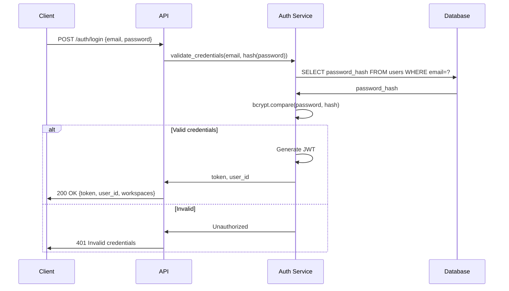
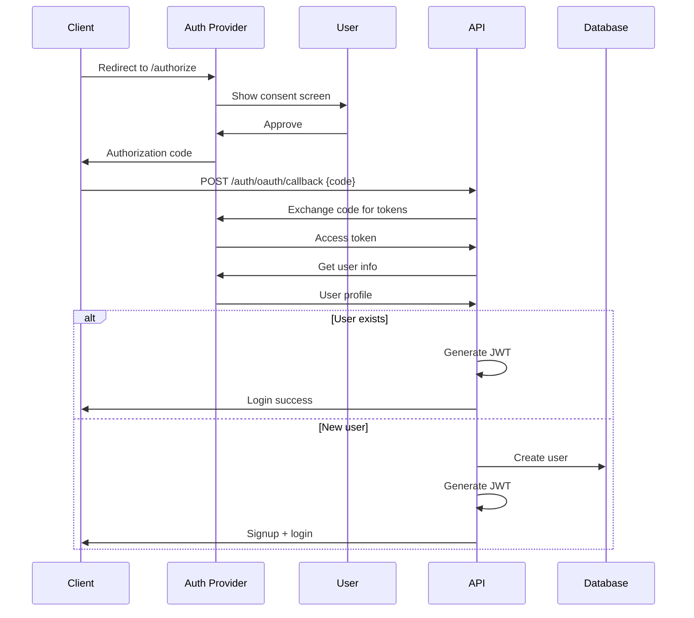
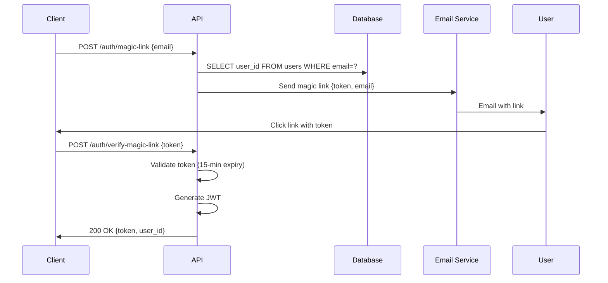

# Agentic Spec Builder - Design Document

**Document Version:** 1.0  
**Last Updated:** 2026-02-04  
**Status:** Implementation Ready  
**Document Owner:** Engineering Leadership

---

## Table of Contents

1. [Design Overview](#1-design-overview)
2. [System Context](#2-system-context)
3. [Technical Architecture](#3-technical-architecture)
4. [API Design](#4-api-design)
5. [Data Design](#5-data-design)
6. [Agent Design](#6-agent-design)
7. [Storage Design](#7-storage-design)
8. [Security Design](#8-security-design)
9. [Scalability Design](#9-scalability-design)
10. [Deployment Design](#10-deployment-design)
11. [Implementation Guide](#11-implementation-guide)

---

## 1. Design Overview

### 1.1 Purpose

The Agentic Spec Builder is an AI-powered system designed to eliminate ambiguity in software specifications through structured interrogation, context management, and automated artifact generation. The system bridges the gap between high-level product ideas and precise engineering specifications that can be executed by developers or AI coding agents.

The core value proposition is transforming fuzzy, ambiguous requirements into atomic, traceable decisions that form the foundation for generating formal artifacts including Product Requirements Documents (PRDs), API contracts, database schemas, engineering tickets, and test specifications.

### 1.2 Scope

The system addresses the following functional boundaries:

**In Scope:**
- Greenfield project specification generation from high-level ideas
- Brownfield project analysis of existing codebases
- Structured decision capture through goal-oriented questioning
- Real-time contradiction detection and validation
- Artifact generation from decision graphs
- Multi-format export for AI agent consumption (Cursor, Claude Code, Devin, etc.)
- Workspace-based collaboration with role-based access control
- Git-style branching and merging for parallel specification exploration

**Out of Scope:**
- Code generation (except test scaffolds and migration files)
- Project management (task tracking, time tracking, reporting)
- Deployment orchestration
- Real-time chat or collaboration messaging
- Direct integration with CI/CD pipelines

### 1.3 Key Design Principles

The architecture is guided by the following foundational principles that inform every technical decision:

**Ambiguity Elimination:** Every piece of information captured by the system must be unambiguous. Questions are designed with concrete options, answers are validated for consistency, and all decisions are traceable to their source. The system actively surfaces contradictions rather than allowing them to propagate into artifacts.

**Agent Specialization:** Each AI agent within the system has a narrowly defined responsibility. The Interrogation Agent focuses solely on question generation, the Validation Agent专注于一致性检查，Specification Agent专注于从决策图生成工件。这种专业化使得每个代理都可以独立优化和扩展，同时通过明确定义的接口进行协调。

**Context Preservation:** Project state must survive across sessions without data loss. The system maintains a structured decision graph that captures not just individual decisions but their dependencies and relationships. This enables intelligent context retrieval and artifact regeneration when decisions change.

**Tenant Isolation:** Multi-tenancy is enforced at every layer. Workspace-level isolation ensures that users cannot access projects outside their authorized scope. This isolation extends to database queries, cache keys, vector storage collections, and file storage paths.

**Graceful Degradation:** The system continues functioning during partial failures. If the Vector DB is unavailable, the system falls back to full conversation history. If the primary LLM provider fails, requests are routed to backup providers. Critical operations have circuit breakers to prevent cascade failures.

**Auditability:** All significant actions are logged with sufficient context to reconstruct the complete history of a project. Decision changes, artifact generations, and user interactions form an immutable audit trail that supports compliance requirements and debugging scenarios.

---

## 2. System Context

### 2.1 Position in the Software Development Lifecycle

The Agentic Spec Builder occupies a unique position between ideation and implementation:

```
Ideation → Requirements → [Agentic Spec Builder] → Implementation → Testing → Deployment
              Phase              Specification
                              Generation
```

The system takes as input:
- High-level product ideas and vision
- Existing codebase (for brownfield projects)
- Supporting documentation (PRDs, tickets, architecture docs)
- User preferences and constraints

The system produces as output:
- Structured decision graphs
- Formal specification artifacts
- Exportable formats for downstream tools
- Change plans for existing systems

### 2.2 External System Integrations

The system integrates with several external services:

**LLM Providers:**
- Anthropic Claude (primary for specification quality)
- OpenAI GPT-4 (fallback provider)
- Replicate/Together (cost-optimized open-source models)

**Git Hosting:**
- GitHub (OAuth integration, repository cloning)
- GitLab (OAuth integration, self-hosted support)

**Email Services:**
- SendGrid (transactional email)
- AWS SES (fallback provider)

**Storage Services:**
- AWS S3 (primary blob storage)
- Google Cloud Storage (fallback)

**Authentication Providers:**
- Google OAuth
- GitHub OAuth
- Microsoft OAuth (enterprise)

### 2.3 User Workflow Context

The system supports three primary user journeys:

**Journey A: Greenfield Project Creation**
A founder or product owner has an idea for a new application and needs to translate that vision into specifications that can be handed to developers or AI coding agents. The workflow involves answering a series of questions, reviewing generated artifacts, and exporting specifications in formats compatible with the target implementation tools.

**Journey B: Brownfield Analysis and Change Planning**
An engineering lead needs to make changes to an existing codebase and requires a safe change plan with impact analysis, rollback procedures, and regression test requirements. The workflow involves connecting to the existing repository, analyzing the current architecture, defining the scope of changes, and generating implementation guidance.

**Journey C: Collaborative Specification Refinement**
Multiple stakeholders (product owners, engineering leads, developers) collaborate on refining a specification. The workflow involves branching to explore alternatives, commenting on artifacts, resolving conflicts, and merging changes back to the main specification branch.

---

## 3. Technical Architecture

### 3.1 High-Level Architecture

The system follows a layered microservices architecture with clear separation of concerns:

```
┌─────────────────────────────────────────────────────────────────────────────┐
│                           Web Client Layer                                   │
│     ┌─────────────────┐  ┌─────────────────┐  ┌─────────────────────┐      │
│     │ React SPA       │  │ Mobile Web      │  │ API Console         │      │
│     │ (Conversation)  │  │ (Responsive)    │  │ (Developer Tools)  │      │
│     └─────────────────┘  └─────────────────┘  └─────────────────────┘      │
└──────────────────────────────────┬──────────────────────────────────────────┘
                                   │ HTTPS / WebSocket
┌──────────────────────────────────▼──────────────────────────────────────────┐
│                      API Gateway / Load Balancer                             │
│         ┌─────────────────────────────────────────────────────────┐         │
│         │  • Rate Limiting  • Authentication  • Routing          │         │
│         │  • Request Validation  • Response Caching                │         │
│         └─────────────────────────────────────────────────────────┘         │
└──────────────────────────────────┬──────────────────────────────────────────┘
                                   │
┌──────────────────────────────────▼──────────────────────────────────────────┐
│                          Orchestration Layer                                 │
│         ┌─────────────────────────────────────────────────────────┐         │
│         │  • Agent Dispatch  • Workflow State Machine             │         │
│         │  • Rate Limiting  • Queue Management                     │         │
│         └─────────────────────────────────────────────────────────┘         │
└──────────────────────────────────┬──────────────────────────────────────────┘
                                   │
               ┌────────────────────┼────────────────────┐
               │                    │                    │
┌─────────────▼────────────┐ ┌────▼─────────┐ ┌─────▼──────────────┐
│      Agent Layer          │ │  Auth Svc    │ │   File Storage     │
│  ┌───────────────────────┐ │ │              │ │   (S3/GCS/Blob)   │
│  │ Interrogation Agent   │ │ │  • JWT/Sess  │ │                    │
│  │ (Claude/GPT-4)       │ │ │  • OAuth    │ │  • User Uploads   │
│  └───────────────────────┘ │ │  • 2FA/SSO   │ │  • Generated      │
│  ┌───────────────────────┐ │ └─────────────┘ │  • Versioned       │
│  │ Specification Agent   │ │                 │ └───────────────────┘
│  │ (Claude + OSS)        │ │                 │
│  └───────────────────────┘ │                 │
│  ┌───────────────────────┐ │                 │
│  │ Validation Agent      │ │                 │
│  │ (Claude)              │ │                 │
│  └───────────────────────┘ │                 │
│  ┌───────────────────────┐ │                 │
│  │ Delivery Agent        │ │                 │
│  │ (GPT-4 + OSS)        │ │                 │
│  └───────────────────────┘ │                 │
│  ┌───────────────────────┐ │                 │
│  │ Context Memory Agent  │ │                 │
│  │ (Vector DB + PG)      │ │                 │
│  └───────────────────────┘ │                 │
└────────────────────────────┼───────────────────────────────────────────────┘
                              │
              ┌───────────────┼───────────────┐
              │               │               │
┌─────────────▼───────┐ ┌────▼─────────┐ ┌───▼────────────────┐
│     Data Layer       │ │  Cache Layer │ │  Code Analysis      │
│  ┌─────────────────┐ │ │              │ │  (Brownfield)      │
│  │ PostgreSQL      │ │ │  • Redis     │ │  • Git Ingestion   │
│  │  • Decisions    │ │ │  • Sessions  │ │  • Multi-lang     │
│  │  • Projects     │ │ │  • Rate Lim  │ │  • Dependency     │
│  │  • Artifacts    │ │ │  • Jobs      │ │  • Static Analysis │
│  │  • Users/Worksp │ │ └─────────────┘ │                     │
│  └─────────────────┘ │                 │                     │
│  ┌─────────────────┐ │                 │                     │
│  │ Vector DB       │ │                 │                     │
│  │ (Embeddings)    │ │                 │                     │
│  └─────────────────┘ │                 │                     │
│  ┌─────────────────┐ │                 │                     │
│  │ Blob Storage    │ │                 │                     │
│  │ (Artifacts)     │ │                 │                     │
│  └─────────────────┘ │                 │                     │
└──────────────────────┼─────────────────┴─────────────────────┘
                        │
                        ▼
             ┌──────────────────────────┐
             │  External LLM Providers   │
             │  • Anthropic (Claude)     │
             │  • OpenAI (GPT-4)         │
             │  • Open-Source (Replicate │
             │    /Together)             │
             └──────────────────────────┘
```

### 3.2 Component Responsibilities

#### 3.2.1 API Gateway

The API Gateway serves as the single entry point for all client requests and is responsible for:

**Request Routing:** Routes incoming requests to appropriate backend services based on the URL path and HTTP method. The gateway maintains routing tables and can dynamically update routes without deployment.

**Authentication Enforcement:** Validates JWT tokens on every request, extracts user identity and permissions from token claims, and rejects requests with invalid or expired tokens. The gateway enforces authentication before requests reach backend services.

**Rate Limiting:** Implements per-user and per-workspace rate limits based on the user's plan tier. Uses Redis-backed counters with sliding window algorithms to prevent abuse while allowing legitimate burst traffic.

**Request Validation:** Validates request payloads against OpenAPI schemas, rejecting malformed requests with descriptive error messages. Validation includes type checking, required field validation, and format validation.

**Response Caching:** Caches GET responses based on Cache-Control headers and configured TTLs. Cache invalidation is triggered on resource modifications through cache purge messages.

**SSL/TLS Termination:** Handles HTTPS connections, terminating SSL/TLS at the gateway level. Internal traffic between gateway and services uses mTLS for enhanced security.

#### 3.2.2 Orchestration Service

The Orchestration Service coordinates workflows across agents and manages system state:

**Agent Dispatch:** Receives requests from the API Gateway and dispatches to appropriate agents based on request type. For synchronous requests, the service waits for agent completion. For asynchronous requests, the service enqueues jobs and returns job IDs.

**Workflow State Machine:** Manages the lifecycle of complex workflows including project creation, artifact generation, and branch merging. Each workflow step transitions the state machine and persists state to PostgreSQL.

**Job Queue Management:** Maintains job queues in Redis for async operations. Workers poll queues, execute jobs, update job status, and handle retries with exponential backoff.

**Rate Limit Enforcement:** Checks rate limits before processing requests, returning 429 responses when limits are exceeded. Rate limit state is stored in Redis for distributed consistency.

**Cross-Agent Communication:** Facilitates communication between agents when workflows require multiple agent interactions. Uses Redis Pub/Sub for event-driven communication.

#### 3.2.3 Agent Layer

The Agent Layer contains specialized AI agents that perform distinct functions:

**Interrogation Agent:** Generates context-aware questions to elicit missing information from users. Uses the decision graph to identify gaps and templates to structure questions.

**Context Memory Agent:** Maintains long-lived project state through vector embeddings and structured storage. Handles context retrieval when agents need historical information.

**Specification Agent:** Converts decision graphs into formal artifacts. Validates that dependencies are satisfied before generation and checkpoints progress for long-running generations.

**Validation Agent:** Performs real-time validation of user answers against existing decisions. Detects contradictions and surfaces conflicts for user resolution.

**Delivery Agent:** Formats artifacts for consumption by various output channels. Supports multiple export formats including AI agent task specifications.

### 3.3 Technology Choices and Rationale

| Component | Technology | Rationale |
|-----------|------------|-----------|
| **API Gateway** | Kong / AWS ALB | Kong provides extensive plugins for rate limiting and auth; ALB integrates seamlessly with AWS ecosystem |
| **Orchestration** | Python / FastAPI | Python's rich ecosystem for AI/ML integration; FastAPI provides async support and automatic OpenAPI generation |
| **Agents** | Python / LangChain | LangChain provides agent orchestration, prompt management, and LLM abstraction |
| **Primary Database** | PostgreSQL 15+ | ACID compliance for transaction integrity; JSONB for flexible metadata storage; robust extension ecosystem |
| **Vector Database** | Pinecone / Weaviate / PGVector | Managed services reduce operational burden; PGVector provides PostgreSQL-native option |
| **Cache** | Redis 7+ | Sub-millisecond latency; native pub/sub for event-driven communication; robust clustering |
| **File Storage** | S3 / GCS / Blob Storage | Cost-effective at scale; built-in versioning and lifecycle management; presigned URLs |
| **Code Analysis** | Tree-sitter / Language Servers | Tree-sitter provides fast, accurate parsing; Language Servers provide rich type information |
| **LLM Providers** | Anthropic, OpenAI, Replicate | Claude for specification quality; GPT-4 for fallback; open-source for cost optimization |
| **Infrastructure** | Kubernetes / Terraform | Container orchestration for scale; Infrastructure as Code for reproducibility |

### 3.4 Data Flow Diagrams

#### 3.4.1 Question Answering Flow

```
User Submit Answer → API Gateway → Orchestration Service
                                               │
                                               ▼
                                        Validation Agent
                                               │
                            ┌──────────────────┼──────────────────┐
                            │                  │                  │
                            ▼                  ▼                  ▼
                    No Contradiction    Contradiction     Invalid Answer
                            │                  │                  │
                            ▼                  ▼                  ▼
                    Context Memory      Conflict UI       Retry Request
                    Agent Update        User Resolves
                            │                  │
                            ▼                  ▼
                    Interrogation Agent   Decision Updated
                            │
                            ▼
                    Next Question → WebSocket → User
```

#### 3.4.2 Artifact Generation Flow

```
User Request Generation → API Gateway → Orchestration Service
                                               │
                                               ▼
                                        Specification Agent
                                               │
                                               ▼
                                        Dependency Check
                            ┌──────────────────┼──────────────────┐
                            │                  │                  │
                            ▼                  ▼                  ▼
                    Dependencies OK     Missing Deps      Dependencies Invalid
                            │                  │                  │
                            ▼                  ▼                  ▼
                    Context Retrieval   List Blockers     Return Error
                            │                  │
                            ▼                  ▼
                    LLM Generation     User Provides
                            │                  │
                            │                  └──────────────────►
                            ▼                          │
                    Checkpoint Save ◄──────────────────┘
                            │
                            ▼
                    Validation Agent
                            │
                            ▼
                    Artifact Stored
                            │
                            ▼
                    Delivery Agent
                            │
                            ▼
                    User Notification (WebSocket)
```

#### 3.4.3 Brownfield Analysis Flow

```
User Initiates Analysis → API Gateway → Orchestration Service
                                               │
                                               ▼
                                        Code Analysis Service
                                               │
                            ┌──────────────────┼──────────────────┐
                            │                  │                  │
                            ▼                  ▼                  ▼
                    Git Clone            OAuth Auth         Scope Selection
                            │                  │                  │
                            ▼                  ▼                  ▼
                    Language Detection    Repo Selection     Directory Filter
                            │
                            ▼
                    Tree-sitter Parsing
                            │
                            ▼
                    Dependency Graph Building
                            │
                            ▼
                    Architecture Inference (LLM)
                            │
                            ▼
                    Current-State Architecture
                            │
                            ▼
                    Impact Analysis (on change)
```

### 3.5 Integration Points

#### 3.5.1 LLM Provider Integration

The system uses a provider abstraction layer to support multiple LLM services:

```python
class LLMProvider(Protocol):
    async def generate(
        self,
        prompt: str,
        max_tokens: int,
        temperature: float,
        **kwargs
    ) -> LLMResponse:
        ...
    
    async def embed(self, text: str) -> EmbeddingResponse:
        ...
```

Each provider implementation handles authentication, retries, and response parsing:

- **AnthropicProvider:** Uses Claude Sonnet 4 for primary generation with Opus 4 fallback for complex artifacts
- **OpenAIProvider:** Uses GPT-4 for fallback scenarios; GPT-3.5 for cost-optimized simple tasks
- **ReplicateProvider:** Uses open-source models (Llama, Mistral) for cost optimization on appropriate tasks

#### 3.5.2 Git Provider Integration

Git providers are integrated through OAuth flows and API clients:

```python
class GitProvider(Protocol):
    async def authenticate(self, oauth_token: str) -> AuthenticatedClient:
        ...
    
    async def clone_repo(self, repo_url: str, dest_path: str) -> CloneResult:
        ...
    
    async def list_files(self, path: str = ".") -> List[FileInfo]:
        ...
```

- **GitHubProvider:** Uses GitHub REST API for repository operations; GitHub GraphQL API for efficient queries
- **GitLabProvider:** Supports both cloud and self-hosted instances; uses GitLab API v4

#### 3.5.3 Storage Integration

Blob storage uses presigned URLs for direct client uploads:

```python
class StorageService:
    async def generate_upload_url(
        self,
        workspace_id: UUID,
        project_id: UUID,
        filename: str,
        content_type: str
    ) -> UploadUrlResponse:
        """Generate presigned URL for direct upload."""
        ...
    
    async def generate_download_url(
        self,
        storage_key: str,
        expires_in: int = 3600
    ) -> DownloadUrlResponse:
        """Generate presigned URL for download."""
        ...
```

---

## 4. API Design

### 4.1 API Design Principles

The REST API follows these design principles:

**Resource-Oriented URLs:** URLs represent resources (projects, decisions, artifacts) and use HTTP methods to express actions. Nested resources follow logical hierarchies.

**Consistent Response Format:** All responses follow a consistent structure with success/error indicators, data payloads, and pagination metadata.

**Versioning:** API versioning is path-based (`/v1/`) to allow for breaking changes without affecting existing clients.

**Idempotency:** POST endpoints that create resources are not idempotent; PUT/PATCH endpoints are idempotent based on resource IDs.

**Backward Compatibility:** Responses may include additional fields without breaking changes. Clients must ignore unknown fields.

### 4.2 Base Configuration

**Base URL:** `https://api.agenticspecbuilder.com/v1`

**Authentication:** Bearer token (JWT) in `Authorization` header

**Content-Type:** `application/json`

**Rate Limits:**
| Tier | Requests/Min | Questions/Day | Projects | Artifact Gens/Day |
|------|--------------|---------------|----------|-------------------|
| Free | 60 | 50 | 10 | 10 |
| Pro | 120 | 200 | 50 | 50 |
| Enterprise | Unlimited | Unlimited | Unlimited | Unlimited |

### 4.3 Authentication Endpoints

#### 4.3.1 POST /auth/signup

Create a new user account.

**Request:**
```json
{
    "email": "user@example.com",
    "password": "SecurePass123!",
    "name": "Alice Smith"
}
```

**Response (201):**
```json
{
    "user_id": "550e8400-e29b-41d4-a716-446655440000",
    "email": "user@example.com",
    "token": "eyJhbGciOiJIUzI1NiIsInR5cCI6IkpXVCJ9...",
    "workspaces": []
}
```

**Error Responses:**
| Status | Error Code | Description |
|--------|------------|-------------|
| 400 | INVALID_EMAIL | Email format is invalid |
| 400 | WEAK_PASSWORD | Password does not meet requirements |
| 409 | EMAIL_EXISTS | Email is already registered |
| 429 | RATE_LIMITED | Too many signup attempts |

#### 4.3.2 POST /auth/login

Authenticate with email and password.

**Request:**
```json
{
    "email": "user@example.com",
    "password": "SecurePass123!"
}
```

**Response (200):**
```json
{
    "token": "eyJhbGciOiJIUzI1NiIsInR5cCI6IkpXVCJ9...",
    "user_id": "550e8400-e29b-41d4-a716-446655440000",
    "workspaces": [
        {
            "workspace_id": "660e8400-e29b-41d4-a716-446655440001",
            "name": "My Startup",
            "role": "owner"
        }
    ],
    "expires_at": "2026-02-04T22:00:00Z"
}
```

**Error Responses:**
| Status | Error Code | Description |
|--------|------------|-------------|
| 401 | INVALID_CREDENTIALS | Email or password is incorrect |
| 401 | ACCOUNT_LOCKED | Too many failed attempts |
| 429 | RATE_LIMITED | Too many login attempts |

#### 4.3.3 POST /auth/logout

Invalidate the current session.

**Request:** (empty)

**Response (200):**
```json
{"status": "logged_out"}
```

#### 4.3.4 POST /auth/magic-link

Request a passwordless login email.

**Request:**
```json
{"email": "user@example.com"}
```

**Response (200):**
```json
{
    "status": "magic_link_sent",
    "expires_in_minutes": 15
}
```

#### 4.3.5 POST /auth/verify-magic-link

Complete magic link authentication.

**Request:**
```json
{
    "token": "one_time_token",
    "expires_at": "2026-02-04T10:15:00Z"
}
```

**Response (200):**
```json
{
    "token": "eyJhbGciOiJIUzI1NiIsInR5cCI6IkpXVCJ9...",
    "user_id": "550e8400-e29b-41d4-a716-446655440000"
}
```

### 4.4 Workspace Endpoints

#### 4.4.1 POST /workspaces

Create a new workspace.

**Request:**
```json
{
    "name": "My Startup"
}
```

**Response (201):**
```json
{
    "workspace_id": "660e8400-e29b-41d4-a716-446655440001",
    "name": "My Startup",
    "owner_user_id": "550e8400-e29b-41d4-a716-446655440000",
    "created_at": "2026-02-04T10:00:00Z",
    "settings": {
        "branch_protection": false,
        "validation_strictness": "standard"
    },
    "plan_tier": "free"
}
```

#### 4.4.2 GET /workspaces

List user's workspaces.

**Response (200):**
```json
{
    "workspaces": [
        {
            "workspace_id": "660e8400-e29b-41d4-a716-446655440001",
            "name": "My Startup",
            "role": "owner",
            "member_count": 3,
            "project_count": 5,
            "created_at": "2026-02-04T10:00:00Z"
        }
    ],
    "total": 1
}
```

#### 4.4.3 GET /workspaces/{workspace_id}

Get workspace details.

**Response (200):**
```json
{
    "workspace_id": "660e8400-e29b-41d4-a716-446655440001",
    "name": "My Startup",
    "owner": {
        "user_id": "550e8400-e29b-41d4-a716-446655440000",
        "name": "Alice"
    },
    "created_at": "2026-02-04T10:00:00Z",
    "settings": {
        "branch_protection": true,
        "validation_strictness": "standard",
        "retention_policy": "paid_indefinite"
    },
    "plan_tier": "pro",
    "members": [
        {
            "user_id": "550e8400-e29b-41d4-a716-446655440000",
            "name": "Alice Smith",
            "email": "alice@example.com",
            "role": "owner",
            "joined_at": "2026-02-04T10:00:00Z"
        }
    ]
}
```

#### 4.4.4 PATCH /workspaces/{workspace_id}

Update workspace settings.

**Request:**
```json
{
    "name": "My Updated Startup",
    "settings": {
        "branch_protection": true,
        "validation_strictness": "strict"
    }
}
```

**Response (200):**
```json
{"status": "updated"}
```

#### 4.4.5 POST /workspaces/{workspace_id}/members

Invite a member to workspace.

**Request:**
```json
{
    "email": "colleague@example.com",
    "role": "editor"
}
```

**Response (201):**
```json
{
    "member_id": "770e8400-e29b-41d4-a716-446655440002",
    "status": "invited",
    "invite_sent_to": "colleague@example.com"
}
```

**Authorization:** Requires owner or admin role

#### 4.4.6 DELETE /workspaces/{workspace_id}/members/{user_id}

Remove member from workspace.

**Response (200):**
```json
{"status": "removed"}
```

**Authorization:** Requires owner or admin role (cannot remove owner)

### 4.5 Project Endpoints

#### 4.5.1 POST /projects

Create a new project.

**Request (Greenfield):**
```json
{
    "workspace_id": "660e8400-e29b-41d4-a716-446655440001",
    "name": "Customer Portal",
    "type": "greenfield",
    "time_investment": "standard",
    "template_id": "880e8400-e29b-41d4-a716-446655440003"
}
```

**Request (Brownfield):**
```json
{
    "workspace_id": "660e8400-e29b-41d4-a716-446655440001",
    "name": "Add OAuth2",
    "type": "brownfield",
    "codebase_url": "https://github.com/user/repo",
    "change_intent": "add_feature",
    "scope_selection": {
        "directories": ["src/auth", "src/api"]
    }
}
```

**Response (201):**
```json
{
    "project_id": "990e8400-e29b-41d4-a716-446655440004",
    "branch_id": "110f8400-e29b-41d4-a716-446655440005",
    "status": "active",
    "created_at": "2026-02-04T10:00:00Z",
    "next_question": {
        "question_id": "220f8400-e29b-41d4-a716-446655440006",
        "text": "Who can create an account?",
        "options": [
            {"value": "anyone", "label": "Anyone with email"},
            {"value": "invite_only", "label": "Invite-only"},
            {"value": "domain", "label": "Anyone with @company.com"}
        ],
        "format": "radio",
        "category": "auth",
        "context": "This determines your user registration flow and access control strategy"
    }
}
```

#### 4.5.2 GET /projects

List workspace projects.

**Query Parameters:**
| Parameter | Type | Default | Description |
|-----------|------|---------|-------------|
| status | string | all | Filter by status (active, paused, archived, completed) |
| type | string | all | Filter by type (greenfield, brownfield) |
| limit | integer | 20 | Number of results |
| offset | integer | 0 | Pagination offset |

**Response (200):**
```json
{
    "projects": [
        {
            "project_id": "990e8400-e29b-41d4-a716-446655440004",
            "name": "Customer Portal",
            "type": "greenfield",
            "status": "active",
            "created_at": "2026-02-04T10:00:00Z",
            "last_activity_at": "2026-02-04T12:00:00Z",
            "decision_count": 25,
            "artifact_count": 3
        }
    ],
    "total": 10,
    "limit": 20,
    "offset": 0
}
```

#### 4.5.3 GET /projects/{project_id}

Get project details.

**Response (200):**
```json
{
    "project_id": "990e8400-e29b-41d4-a716-446655440004",
    "name": "Customer Portal",
    "type": "greenfield",
    "status": "active",
    "time_investment": "standard",
    "template_id": "880e8400-e29b-41d4-a716-446655440003",
    "created_by": {
        "user_id": "550e8400-e29b-41d4-a716-446655440000",
        "name": "Alice"
    },
    "created_at": "2026-02-04T10:00:00Z",
    "last_activity_at": "2026-02-04T12:00:00Z",
    "settings": {
        "tech_stack": {
            "backend_lang": "python",
            "frontend_lang": "react",
            "database": "postgresql"
        }
    },
    "stats": {
        "decision_count": 25,
        "question_count": 28,
        "artifact_count": 3,
        "branch_count": 2
    },
    "main_branch": {
        "branch_id": "110f8400-e29b-41d4-a716-446655440005",
        "name": "main"
    }
}
```

#### 4.5.4 PATCH /projects/{project_id}

Update project.

**Request:**
```json
{
    "status": "paused",
    "settings": {
        "tech_stack": {
            "backend_lang": "python",
            "frontend_lang": "react",
            "database": "postgresql",
            "cache": "redis"
        }
    }
}
```

**Response (200):**
```json
{"status": "updated"}
```

### 4.6 Question and Answer Endpoints

#### 4.6.1 GET /projects/{project_id}/questions/pending

List pending questions.

**Response (200):**
```json
{
    "questions": [
        {
            "question_id": "220f8400-e29b-41d4-a716-446655440006",
            "text": "Database technology?",
            "category": "database",
            "options": [
                {"value": "postgresql", "label": "PostgreSQL"},
                {"value": "mysql", "label": "MySQL"},
                {"value": "mongodb", "label": "MongoDB"}
            ],
            "format": "radio",
            "asked_at": "2026-02-04T10:30:00Z",
            "depends_on_decisions": ["110f8400-e29b-41d4-a716-446655440007"]
        }
    ],
    "parked": [],
    "by_artifact": {
        "prd": {"remaining": 5, "questions": [...]},
        "api_contract": {"remaining": 8, "questions": [...]}
    }
}
```

#### 4.6.2 POST /projects/{project_id}/answers

Submit answer to question.

**Request:**
```json
{
    "branch_id": "110f8400-e29b-41d4-a716-446655440005",
    "question_id": "220f8400-e29b-41d4-a716-446655440006",
    "answer": "postgresql"
}
```

**Response (200 - no contradiction):**
```json
{
    "decision_id": "330f8400-e29b-41d4-a716-446655440008",
    "contradiction_detected": false,
    "next_question": {
        "question_id": "440f8400-e29b-41d4-a716-446655440009",
        "text": "Database connection pooling?",
        "options": [
            {"value": "pgbouncer", "label": "PgBouncer"},
            {"value": "built_in", "label": "Built-in pooling"},
            {"value": "none", "label": "No pooling"}
        ],
        "format": "checkbox",
        "category": "database",
        "context": "Connection pooling affects performance and resource usage"
    }
}
```

**Response (200 - contradiction detected):**
```json
{
    "contradiction_detected": true,
    "conflict": {
        "decision_id": "330f8400-e29b-41d4-a716-446655440008",
        "previous_decision": {
            "decision_id": "110f8400-e29b-41d4-a716-446655440010",
            "question": "Require authentication?",
            "answer": "no"
        },
        "current_answer": "Users have profiles",
        "prompt": "Users can't have profiles without authentication. Which is correct?"
    }
}
```

#### 4.6.3 POST /projects/{project_id}/defer-question

Defer question to "ask later".

**Request:**
```json
{
    "branch_id": "110f8400-e29b-41d4-a716-446655440005",
    "question_id": "440f8400-e29b-41d4-a716-446655440009"
}
```

**Response (200):**
```json
{
    "status": "deferred",
    "next_question": {
        "question_id": "550f8400-e29b-41d4-a716-446655440011",
        ...
    }
}
```

### 4.7 Branch Endpoints

#### 4.7.1 POST /projects/{project_id}/branches

Create feature branch.

**Request:**
```json
{
    "name": "feature/improve-auth",
    "parent_branch_id": "110f8400-e29b-41d4-a716-446655440005"
}
```

**Response (201):**
```json
{
    "branch_id": "660f8400-e29b-41d4-a716-446655440012",
    "name": "feature/improve-auth",
    "created_at": "2026-02-04T10:30:00Z",
    "created_by": {
        "user_id": "550e8400-e29b-41d4-a716-446655440000",
        "name": "Alice"
    }
}
```

#### 4.7.2 GET /projects/{project_id}/branches

List project branches.

**Response (200):**
```json
{
    "branches": [
        {
            "branch_id": "110f8400-e29b-41d4-a716-446655440005",
            "name": "main",
            "is_protected": true,
            "created_at": "2026-02-04T10:00:00Z",
            "merged_at": null,
            "decision_count": 25
        },
        {
            "branch_id": "660f8400-e29b-41d4-a716-446655440012",
            "name": "feature/improve-auth",
            "parent_branch_id": "110f8400-e29b-41d4-a716-446655440005",
            "is_protected": false,
            "created_at": "2026-02-04T10:30:00Z",
            "merged_at": null,
            "created_by": {
                "user_id": "550e8400-e29b-41d4-a716-446655440000",
                "name": "Alice"
            },
            "decision_count": 5
        }
    ]
}
```

#### 4.7.3 POST /projects/{project_id}/branches/{branch_id}/merge

Merge branch to target.

**Request:**
```json
{
    "target_branch_id": "110f8400-e29b-41d4-a716-446655440005"
}
```

**Response (200 - no conflicts):**
```json
{
    "status": "merged",
    "merged_at": "2026-02-04T10:35:00Z",
    "decisions_merged": 5,
    "artifacts_updated": 2
}
```

**Response (200 - conflicts):**
```json
{
    "status": "conflicts",
    "conflicts": [
        {
            "decision_id": "770f8400-e29b-41d4-a716-446655440013",
            "question": "Authentication method?",
            "main_answer": "JWT",
            "feature_answer": "OAuth2",
            "context": "Both branches have answered this question"
        }
    ]
}
```

#### 4.7.4 POST /projects/{project_id}/branches/{branch_id}/resolve-conflicts

Resolve merge conflicts.

**Request:**
```json
{
    "resolutions": [
        {
            "decision_id": "770f8400-e29b-41d4-a716-446655440013",
            "chosen_answer": "OAuth2"
        }
    ]
}
```

**Response (200):**
```json
{
    "status": "conflicts_resolved",
    "ready_to_merge": true
}
```

### 4.8 Artifact Endpoints

#### 4.8.1 POST /projects/{project_id}/artifacts

Generate artifact.

**Request:**
```json
{
    "branch_id": "110f8400-e29b-41d4-a716-446655440005",
    "type": "prd",
    "formats": ["markdown", "pdf", "html"],
    "tech_stack": {
        "backend_lang": "python",
        "frontend_lang": "react"
    }
}
```

**Response (202 - async):**
```json
{
    "job_id": "880f8400-e29b-41d4-a716-446655440014",
    "status": "generating",
    "estimated_seconds": 30,
    "progress_url": "/jobs/880f8400-e29b-41d4-a716-446655440014"
}
```

#### 4.8.2 GET /jobs/{job_id}

Check artifact generation status.

**Response (200 - in-progress):**
```json
{
    "job_id": "880f8400-e29b-41d4-a716-446655440014",
    "status": "generating",
    "progress": 45,
    "message": "Generating API specifications..."
}
```

**Response (200 - complete):**
```json
{
    "job_id": "880f8400-e29b-41d4-a716-446655440014",
    "status": "complete",
    "artifact_id": "990f8400-e29b-41d4-a716-446655440015",
    "download_urls": {
        "markdown": "https://storage.example.com/artifacts/990f8400-e29b-41d4-a716-446655440015/v1/prd.md",
        "pdf": "https://storage.example.com/artifacts/990f8400-e29b-41d4-a716-446655440015/v1/prd.pdf",
        "html": "https://storage.example.com/artifacts/990f8400-e29b-41d4-a716-446655440015/v1/prd.html"
    }
}
```

**Response (200 - failed):**
```json
{
    "job_id": "880f8400-e29b-41d4-a716-446655440014",
    "status": "failed",
    "error": "LLM timeout",
    "error_code": "GENERATION_TIMEOUT",
    "retryable": true
}
```

#### 4.8.3 GET /projects/{project_id}/artifacts

List project artifacts.

**Response (200):**
```json
{
    "artifacts": [
        {
            "artifact_id": "990f8400-e29b-41d4-a716-446655440015",
            "type": "prd",
            "format": "markdown",
            "version": 3,
            "is_stale": false,
            "generated_at": "2026-02-04T12:00:00Z",
            "generated_by_agent": "specification",
            "download_url": "https://storage.example.com/..."
        },
        {
            "artifact_id": "110f8500-e29b-41d4-a716-446655440016",
            "type": "api_contract",
            "format": "openapi",
            "version": 2,
            "is_stale": false,
            "generated_at": "2026-02-04T12:30:00Z",
            "generated_by_agent": "specification"
        }
    ]
}
```

#### 4.8.4 GET /artifacts/{artifact_id}

Get artifact content.

**Response (200):**
```json
{
    "artifact_id": "990f8400-e29b-41d4-a716-446655440015",
    "project_id": "990e8400-e29b-41d4-a716-446655440004",
    "type": "prd",
    "content": "# Product Requirements Document\n\n## Overview\n\n...",
    "format": "markdown",
    "version": 3,
    "based_on_decisions": [
        "330f8400-e29b-41d4-a716-446655440008",
        "440f8400-e29b-41d4-a716-446655440009"
    ],
    "generated_at": "2026-02-04T12:00:00Z",
    "is_stale": false,
    "tech_stack": {
        "backend_lang": "python",
        "frontend_lang": "react",
        "database": "postgresql"
    }
}
```

#### 4.8.5 POST /artifacts/{artifact_id}/export

Export artifact in specific format.

**Request:**
```json
{
    "format": "github_issues",
    "options": {
        "labels": ["backend", "high-priority"],
        "assignees": []
    }
}
```

**Response (200):**
```json
{
    "export": [
        {
            "title": "[Backend] Create User model",
            "body": "## Overview\n\nCreate a User model for the Customer Portal...",
            "labels": ["backend", "high-priority"],
            "assignees": []
        },
        {
            "title": "[Backend] Implement authentication",
            "body": "## Overview\n\nImplement JWT authentication...",
            "labels": ["backend", "feature"],
            "assignees": []
        }
    ]
}
```

#### 4.8.6 GET /artifacts/{artifact_id}/versions

List artifact versions.

**Response (200):**
```json
{
    "versions": [
        {
            "version_id": "220f8500-e29b-41d4-a716-446655440017",
            "version_number": 3,
            "created_at": "2026-02-04T12:00:00Z",
            "created_by": {
                "user_id": "550e8400-e29b-41d4-a716-446655440000",
                "name": "Alice"
            },
            "change_summary": "Updated authentication section"
        },
        {
            "version_id": "330f8500-e29b-41d4-a716-446655440018",
            "version_number": 2,
            "created_at": "2026-02-04T11:30:00Z",
            "created_by": {
                "user_id": "550e8400-e29b-41d4-a716-446655440000",
                "name": "Alice"
            }
        }
    ]
}
```

#### 4.8.7 GET /artifacts/{artifact_id}/diff

Get diff between versions.

**Query Parameters:**
| Parameter | Type | Default | Description |
|-----------|------|---------|-------------|
| from_version | integer | latest-1 | Source version number |
| to_version | integer | latest | Target version number |

**Response (200):**
```json
{
    "from_version": 2,
    "to_version": 3,
    "diff": "--- a/prd.md\n+++ b/prd.md\n@@ -10,7 +10,7 @@\n ## Authentication\n \n-Users will authenticate using JWT tokens.\n+Users will authenticate using OAuth2.\n \n ## User Management\n",
    "changes": {
        "additions": 3,
        "deletions": 1,
        "modifications": 1
    }
}
```

### 4.9 Comment Endpoints

#### 4.9.1 POST /artifacts/{artifact_id}/comments

Add comment to artifact.

**Request:**
```json
{
    "section": "line 45-60",
    "type": "issue",
    "text": "Missing CSRF protection for this endpoint"
}
```

**Response (201):**
```json
{
    "comment_id": "440f8500-e29b-41d4-a716-446655440019",
    "agent_action": "re_questioning",
    "new_question": {
        "question_id": "550f8500-e29b-41d4-a716-446655440020",
        "text": "Should CSRF protection be added for API endpoints?",
        "options": [
            {"value": "yes", "label": "Yes, all endpoints"},
            {"value": "state_changing", "label": "Only state-changing endpoints"},
            {"value": "no", "label": "No, use other protections"}
        ],
        "format": "radio"
    }
}
```

#### 4.9.2 GET /artifacts/{artifact_id}/comments

List artifact comments.

**Response (200):**
```json
{
    "comments": [
        {
            "comment_id": "440f8500-e29b-41d4-a716-446655440019",
            "section": "Authentication section",
            "user": {
                "user_id": "660e8400-e29b-41d4-a716-446655440021",
                "name": "Bob"
            },
            "comment_type": "issue",
            "text": "We need API key rotation",
            "replies": [
                {
                    "comment_id": "660f8500-e29b-41d4-a716-446655440022",
                    "user": {
                        "user_id": "550e8400-e29b-41d4-a716-446655440000",
                        "name": "Alice"
                    },
                    "text": "Good point, I'll add this to the requirements",
                    "created_at": "2026-02-04T14:30:00Z"
                }
            ],
            "created_at": "2026-02-04T14:00:00Z",
            "resolved_at": null
        }
    ]
}
```

#### 4.9.3 POST /comments/{comment_id}/resolve

Mark comment as resolved.

**Response (200):**
```json
{"status": "resolved"}
```

### 4.10 Codebase Analysis Endpoints (Brownfield)

#### 4.10.1 POST /codebase/analyze

Trigger brownfield analysis.

**Request:**
```json
{
    "project_id": "990e8400-e29b-41d4-a716-446655440004",
    "source": "github",
    "repo_url": "https://github.com/user/repo",
    "scope_selection": {
        "directories": ["src/auth", "src/api"]
    }
}
```

**Response (202):**
```json
{
    "analysis_id": "770f8500-e29b-41d4-a716-446655440023",
    "status": "cloning",
    "estimated_minutes": 5,
    "progress_url": "/codebase/analyses/770f8500-e29b-41d4-a716-446655440023"
}
```

#### 4.10.2 GET /codebase/analyses/{analysis_id}

Check analysis status and results.

**Response (200 - complete):**
```json
{
    "analysis_id": "770f8500-e29b-41d4-a716-446655440023",
    "status": "complete",
    "codebase_url": "https://github.com/user/repo",
    "codebase_size_loc": 250000,
    "languages_detected": [
        {"language": "typescript", "loc_count": 150000},
        {"language": "python", "loc_count": 100000}
    ],
    "architecture_derived": "Microservices architecture with API gateway at /api",
    "architecture_diagram": "```mermaid\ngraph TD\n    Client[Client] --> APIG[API Gateway]\n    APIG --> Auth[Auth Service]\n    APIG --> Users[Users Service]\n    APIG --> Orders[Orders Service]\n```",
    "dependency_graph": {
        "nodes": [...],
        "edges": [...]
    },
    "components": [
        {
            "name": "Auth Service",
            "path": "src/auth",
            "language": "typescript",
            "dependencies": ["src/shared", "src/users"]
        }
    ],
    "analyzed_at": "2026-02-04T15:00:00Z",
    "analysis_duration_seconds": 285
}
```

#### 4.10.3 GET /projects/{project_id}/impact-analysis

Get impact analysis for proposed change.

**Request:**
```json
{
    "change_description": "Add OAuth2 authentication",
    "affected_files": ["src/auth/oauth2.py", "src/api/users.py"]
}
```

**Response (200):**
```json
{
    "impact_analysis_id": "880f8500-e29b-41d4-a716-446655440024",
    "change_description": "Add OAuth2 authentication",
    "files": {
        "create": ["src/auth/providers/oauth2.py"],
        "modify": ["src/auth/handlers.py", "src/api/users.py", "tests/auth/"],
        "delete": []
    },
    "risk_assessment": {
        "overall": "high",
        "breaking_changes": [],
        "affected_features": ["User login", "API authentication"],
        "tests_affected": {
            "new_tests_needed": 5,
            "tests_to_modify": 18
        }
    },
    "downstream_dependencies": [
        {"file": "src/api/orders.py", "impact": "medium", "reason": "Uses auth middleware"}
    ],
    "migration_requirements": {
        "database": [],
        "api_contract": [],
        "configuration": ["Add OAuth2 provider credentials"]
    }
}
```

### 4.11 Error Response Format

All error responses follow this format:

```json
{
    "error": {
        "code": "ERROR_CODE",
        "message": "Human-readable error message",
        "details": {
            // Additional error details
        }
    },
    "request_id": "uuid-for-tracing",
    "timestamp": "2026-02-04T10:00:00Z"
}
```

**Common Error Codes:**

| Code | HTTP Status | Description |
|------|-------------|-------------|
| VALIDATION_ERROR | 400 | Request validation failed |
| UNAUTHORIZED | 401 | Authentication required or invalid |
| FORBIDDEN | 403 | Insufficient permissions |
| NOT_FOUND | 404 | Resource not found |
| CONFLICT | 409 | Resource conflict (e.g., contradiction detected) |
| RATE_LIMITED | 429 | Rate limit exceeded |
| INTERNAL_ERROR | 500 | Server error |
| SERVICE_UNAVAILABLE | 503 | Service temporarily unavailable |

---

## 5. Data Design

### 5.1 Database Strategy

The system uses a polyglot persistence approach with PostgreSQL as the primary relational store and specialized databases for specific use cases:

- **PostgreSQL:** Structured data (users, workspaces, projects, decisions, artifacts)
- **Vector Database:** Decision embeddings for semantic search
- **Redis:** Caching, sessions, rate limiting, job queues
- **Blob Storage:** Large files, generated artifacts

### 5.2 PostgreSQL Schema Design

#### 5.2.1 Users Table

```sql
CREATE TABLE users (
    user_id UUID PRIMARY KEY DEFAULT gen_random_uuid(),
    email VARCHAR(255) UNIQUE NOT NULL,
    password_hash VARCHAR(255),
    name VARCHAR(255) NOT NULL,
    totp_secret TEXT,
    totp_enabled BOOLEAN DEFAULT FALSE,
    oauth_providers JSONB DEFAULT '[]'::jsonb,
    created_at TIMESTAMPTZ DEFAULT NOW(),
    last_login_at TIMESTAMPTZ,
    deleted_at TIMESTAMPTZ,
    
    CONSTRAINT chk_email_format CHECK (
        email ~ '^[A-Za-z0-9._%+-]+@[A-Za-z0-9.-]+\.[A-Za-z]{2,}$'
    ),
    CONSTRAINT chk_password_hash CHECK (
        password_hash IS NULL OR password_hash LIKE '$2b$12$%'
    )
);

CREATE INDEX idx_users_email ON users(email);
CREATE INDEX idx_users_deleted_at ON users(deleted_at) WHERE deleted_at IS NULL;
```

**Rationale:** UUIDs provide globally unique identifiers without central coordination. The email regex ensures valid format before database insertion. Password hash is nullable to support OAuth-only users.

#### 5.2.2 Workspaces Table

```sql
CREATE TABLE workspaces (
    workspace_id UUID PRIMARY KEY DEFAULT gen_random_uuid(),
    name VARCHAR(255) NOT NULL,
    owner_user_id UUID NOT NULL REFERENCES users(user_id) ON DELETE CASCADE,
    created_at TIMESTAMPTZ DEFAULT NOW(),
    settings JSONB DEFAULT '{}'::jsonb CHECK (
        jsonb_validate(
            '{
                "type": "object",
                "properties": {
                    "branch_protection": {"type": "boolean"},
                    "validation_strictness": {"type": "string", "enum": ["minimal", "standard", "strict"]},
                    "retention_policy": {"type": "string", "enum": ["free_90d", "paid_indefinite", "enterprise_custom"]}
                },
                "additionalProperties": false
            }',
            settings
        )
    ),
    plan_tier TEXT DEFAULT 'free' CHECK (plan_tier IN ('free', 'pro', 'enterprise'))
);

CREATE INDEX idx_workspaces_owner ON workspaces(owner_user_id);
```

**Rationale:** JSONB settings allow flexible configuration without schema migrations. Check constraint ensures settings validity.

#### 5.2.3 Workspace Members Table

```sql
CREATE TABLE workspace_members (
    member_id UUID PRIMARY KEY DEFAULT gen_random_uuid(),
    workspace_id UUID NOT NULL REFERENCES workspaces(workspace_id) ON DELETE CASCADE,
    user_id UUID NOT NULL REFERENCES users(user_id) ON DELETE CASCADE,
    role TEXT NOT NULL CHECK (role IN ('owner', 'admin', 'editor', 'viewer')),
    invited_by UUID REFERENCES users(user_id),
    invited_at TIMESTAMPTZ DEFAULT NOW(),
    joined_at TIMESTAMPTZ,
    
    UNIQUE (workspace_id, user_id)
);

CREATE INDEX idx_workspace_members_workspace ON workspace_members(workspace_id);
CREATE INDEX idx_workspace_members_user ON workspace_members(user_id);
```

**Rationale:** Many-to-many join table with composite unique constraint to prevent duplicate memberships.

#### 5.2.4 Projects Table

```sql
CREATE TABLE projects (
    project_id UUID PRIMARY KEY DEFAULT gen_random_uuid(),
    workspace_id UUID NOT NULL REFERENCES workspaces(workspace_id) ON DELETE CASCADE,
    name VARCHAR(255) NOT NULL,
    type TEXT NOT NULL CHECK (type IN ('greenfield', 'brownfield')),
    status TEXT DEFAULT 'active' CHECK (status IN ('active', 'paused', 'archived', 'completed')),
    time_investment TEXT CHECK (time_investment IN ('quick', 'standard', 'comprehensive')),
    template_id UUID REFERENCES templates(template_id),
    created_by UUID REFERENCES users(user_id),
    created_at TIMESTAMPTZ DEFAULT NOW(),
    last_activity_at TIMESTAMPTZ DEFAULT NOW(),
    settings JSONB DEFAULT '{}'::jsonb,
    codebase_url TEXT,
    codebase_size_loc INTEGER,
    deleted_at TIMESTAMPTZ
);

CREATE INDEX idx_projects_workspace ON projects(workspace_id);
CREATE INDEX idx_projects_status ON projects(status);
CREATE INDEX idx_projects_created_by ON projects(created_by);
CREATE INDEX idx_projects_deleted_at ON projects(deleted_at) WHERE deleted_at IS NULL;
```

**Rationale:** Soft delete via deleted_at allows data recovery and audit trails. last_activity_at enables automatic archiving of inactive projects.

#### 5.2.5 Branches Table

```sql
CREATE TABLE branches (
    branch_id UUID PRIMARY KEY DEFAULT gen_random_uuid(),
    project_id UUID NOT NULL REFERENCES projects(project_id) ON DELETE CASCADE,
    name VARCHAR(255) NOT NULL,
    parent_branch_id UUID REFERENCES branches(branch_id),
    created_by UUID REFERENCES users(user_id),
    created_at TIMESTAMPTZ DEFAULT NOW(),
    merged_at TIMESTAMPTZ,
    merged_by UUID REFERENCES users(user_id),
    is_protected BOOLEAN DEFAULT FALSE,
    deleted_at TIMESTAMPTZ
);

CREATE INDEX idx_branches_project ON branches(project_id);
CREATE UNIQUE INDEX idx_branches_project_name ON branches(project_id, name) 
    WHERE deleted_at IS NULL;
CREATE INDEX idx_branches_parent ON branches(parent_branch_id);
```

**Rationale:** Git-style branching with parent references for merge tracking. Unique index on project+name prevents duplicate branch names.

#### 5.2.6 Decisions Table

```sql
CREATE TABLE decisions (
    decision_id UUID PRIMARY KEY DEFAULT gen_random_uuid(),
    project_id UUID NOT NULL REFERENCES projects(project_id) ON DELETE CASCADE,
    branch_id UUID NOT NULL REFERENCES branches(branch_id) ON DELETE CASCADE,
    question_id UUID NOT NULL,
    question_text TEXT NOT NULL,
    answer_text TEXT NOT NULL,
    options_presented JSONB DEFAULT '[]'::jsonb,
    category TEXT CHECK (category IN (
        'auth', 'database', 'api', 'ui', 'deployment', 
        'integration', 'security', 'performance', 'other'
    )),
    is_assumption BOOLEAN DEFAULT FALSE,
    assumption_reasoning TEXT,
    dependencies JSONB DEFAULT '[]'::jsonb,
    answered_by UUID REFERENCES users(user_id),
    answered_at TIMESTAMPTZ DEFAULT NOW(),
    version INTEGER DEFAULT 1,
    is_locked BOOLEAN DEFAULT FALSE,
    deleted_at TIMESTAMPTZ
);

CREATE INDEX idx_decisions_project ON decisions(project_id);
CREATE INDEX idx_decisions_branch ON decisions(branch_id);
CREATE INDEX idx_decisions_category ON decisions(category);
CREATE INDEX idx_decisions_answered_at ON decisions(answered_at);
CREATE INDEX idx_decisions_question ON decisions(project_id, question_id) 
    WHERE deleted_at IS NULL;
```

**Rationale:** decisions are soft-deleted for audit trails. version field enables historical tracking. question_id allows correlation across branches.

#### 5.2.7 Decision Dependencies Table

```sql
CREATE TABLE decision_dependencies (
    dependency_id UUID PRIMARY KEY DEFAULT gen_random_uuid(),
    decision_id UUID NOT NULL REFERENCES decisions(decision_id) ON DELETE CASCADE,
    depends_on_decision_id UUID NOT NULL REFERENCES decisions(decision_id) ON DELETE CASCADE,
    created_at TIMESTAMPTZ DEFAULT NOW(),
    
    UNIQUE (decision_id, depends_on_decision_id)
);

CREATE INDEX idx_decision_dependencies_decision ON decision_dependencies(decision_id);
CREATE INDEX idx_decision_dependencies_depends_on ON decision_dependencies(depends_on_decision_id);
```

**Rationale:** Explicit dependency tracking enables impact analysis when decisions change. Unique constraint prevents duplicate dependencies.

#### 5.2.8 Artifacts Table

```sql
CREATE TABLE artifacts (
    artifact_id UUID PRIMARY KEY DEFAULT gen_random_uuid(),
    project_id UUID NOT NULL REFERENCES projects(project_id) ON DELETE CASCADE,
    branch_id UUID NOT NULL REFERENCES branches(branch_id) ON DELETE CASCADE,
    type TEXT NOT NULL CHECK (type IN (
        'prd', 'schema', 'api_contract', 'tickets', 
        'architecture', 'tests', 'deployment_plan', 'change_plan'
    )),
    content TEXT,
    blob_storage_key TEXT,
    format TEXT NOT NULL CHECK (format IN (
        'markdown', 'json', 'yaml', 'sql', 'gherkin', 
        'mermaid', 'html', 'pdf', 'openapi', 'graphql', 'protobuf'
    )),
    version INTEGER DEFAULT 1,
    based_on_decisions JSONB DEFAULT '[]'::jsonb,
    generated_by_agent TEXT CHECK (generated_by_agent IN ('specification', 'delivery')),
    generated_at TIMESTAMPTZ DEFAULT NOW(),
    is_stale BOOLEAN DEFAULT FALSE,
    tech_stack JSONB,
    deleted_at TIMESTAMPTZ
);

CREATE INDEX idx_artifacts_project ON artifacts(project_id);
CREATE INDEX idx_artifacts_branch ON artifacts(branch_id);
CREATE INDEX idx_artifacts_type ON artifacts(type);
CREATE INDEX idx_artifacts_is_stale ON artifacts(is_stale) WHERE is_stale = TRUE;
CREATE INDEX idx_artifacts_based_on_decisions ON artifacts USING GIN (based_on_decisions);
```

**Rationale:** GIN index on based_on_decisions enables fast queries for artifacts affected by specific decisions.

#### 5.2.9 Artifact Versions Table

```sql
CREATE TABLE artifact_versions (
    version_id UUID PRIMARY KEY DEFAULT gen_random_uuid(),
    artifact_id UUID NOT NULL REFERENCES artifacts(artifact_id) ON DELETE CASCADE,
    version_number INTEGER NOT NULL,
    content TEXT NOT NULL,
    based_on_decisions JSONB,
    created_at TIMESTAMPTZ DEFAULT NOW(),
    created_by UUID REFERENCES users(user_id),
    content_hash TEXT NOT NULL,
    
    UNIQUE (artifact_id, version_number)
);

CREATE INDEX idx_artifact_versions_artifact ON artifact_versions(artifact_id);
CREATE INDEX idx_artifact_versions_created_at ON artifact_versions(created_at DESC);
```

**Rationale:** content_hash enables efficient change detection. Version number uniqueness per artifact.

#### 5.2.10 Comments Table

```sql
CREATE TABLE comments (
    comment_id UUID PRIMARY KEY DEFAULT gen_random_uuid(),
    artifact_id UUID NOT NULL REFERENCES artifacts(artifact_id) ON DELETE CASCADE,
    section VARCHAR(255),
    user_id UUID NOT NULL REFERENCES users(user_id) ON DELETE CASCADE,
    comment_type TEXT NOT NULL CHECK (comment_type IN ('question', 'issue', 'suggestion', 'approval')),
    text TEXT NOT NULL,
    parent_comment_id UUID REFERENCES comments(comment_id) ON DELETE CASCADE,
    created_at TIMESTAMPTZ DEFAULT NOW(),
    resolved_at TIMESTAMPTZ,
    resolved_by UUID REFERENCES users(user_id),
    deleted_at TIMESTAMPTZ
);

CREATE INDEX idx_comments_artifact ON comments(artifact_id);
CREATE INDEX idx_comments_parent ON comments(parent_comment_id);
CREATE INDEX idx_comments_user ON comments(user_id);
CREATE INDEX idx_comments_created_at ON comments(created_at DESC);
```

**Rationale:** Self-referential parent_comment_id enables threaded comments.

#### 5.2.11 Conversation Turns Table

```sql
CREATE TABLE conversation_turns (
    turn_id UUID PRIMARY KEY DEFAULT gen_random_uuid(),
    project_id UUID NOT NULL REFERENCES projects(project_id) ON DELETE CASCADE,
    branch_id UUID NOT NULL REFERENCES branches(branch_id) ON DELETE CASCADE,
    turn_number INTEGER NOT NULL,
    agent TEXT NOT NULL CHECK (agent IN ('interrogation', 'specification', 'validation', 'delivery')),
    message TEXT NOT NULL,
    user_response TEXT,
    metadata JSONB DEFAULT '{}'::jsonb,
    timestamp TIMESTAMPTZ DEFAULT NOW()
);

CREATE INDEX idx_conversation_turns_project ON conversation_turns(project_id, branch_id, turn_number);
CREATE INDEX idx_conversation_turns_timestamp ON conversation_turns(timestamp DESC);
```

**Rationale:** Turn numbering enables chronological retrieval. metadata stores additional context like question format.

#### 5.2.12 Codebase Analyses Table

```sql
CREATE TABLE codebase_analyses (
    analysis_id UUID PRIMARY KEY DEFAULT gen_random_uuid(),
    project_id UUID NOT NULL REFERENCES projects(project_id) ON DELETE CASCADE,
    codebase_url TEXT NOT NULL,
    codebase_size_loc INTEGER,
    languages_detected JSONB DEFAULT '[]'::jsonb,
    architecture_derived TEXT,
    architecture_diagram TEXT,
    dependency_graph JSONB,
    components JSONB DEFAULT '[]'::jsonb,
    analyzed_at TIMESTAMPTZ DEFAULT NOW(),
    analysis_duration_seconds INTEGER,
    status TEXT DEFAULT 'pending' CHECK (status IN ('pending', 'cloning', 'analyzing', 'complete', 'failed')),
    error_message TEXT
);

CREATE INDEX idx_codebase_analyses_project ON codebase_analyses(project_id);
CREATE INDEX idx_codebase_analyses_status ON codebase_analyses(status);
CREATE INDEX idx_codebase_analyses_analyzed_at ON codebase_analyses(analyzed_at DESC);
```

**Rationale:** JSONB columns store flexible analysis results. Status enables polling for async operations.

#### 5.2.13 Impact Analyses Table

```sql
CREATE TABLE impact_analyses (
    impact_analysis_id UUID PRIMARY KEY DEFAULT gen_random_uuid(),
    project_id UUID NOT NULL REFERENCES projects(project_id) ON DELETE CASCADE,
    change_description TEXT NOT NULL,
    files_create JSONB DEFAULT '[]'::jsonb,
    files_modify JSONB DEFAULT '[]'::jsonb,
    files_delete JSONB DEFAULT '[]'::jsonb,
    risk_assessment TEXT CHECK (risk_assessment IN ('low', 'medium', 'high', 'critical')),
    breaking_changes JSONB DEFAULT '[]'::jsonb,
    affected_features JSONB DEFAULT '[]'::jsonb,
    downstream_dependencies JSONB DEFAULT '[]'::jsonb,
    migration_requirements JSONB DEFAULT '{}'::jsonb,
    analyzed_at TIMESTAMPTZ DEFAULT NOW(),
    analyzed_by UUID REFERENCES users(user_id)
);

CREATE INDEX idx_impact_analyses_project ON impact_analyses(project_id);
CREATE INDEX idx_impact_analyses_analyzed_at ON impact_analyses(analyzed_at DESC);
```

#### 5.2.14 Templates Table

```sql
CREATE TABLE templates (
    template_id UUID PRIMARY KEY DEFAULT gen_random_uuid(),
    name VARCHAR(255) NOT NULL,
    type TEXT NOT NULL CHECK (type IN ('system', 'workspace', 'community')),
    workspace_id UUID REFERENCES workspaces(workspace_id) ON DELETE SET NULL,
    description TEXT,
    question_flow JSONB NOT NULL,
    default_tech_stack JSONB,
    created_by UUID REFERENCES users(user_id),
    created_at TIMESTAMPTZ DEFAULT NOW(),
    is_active BOOLEAN DEFAULT TRUE
);

CREATE INDEX idx_templates_type ON templates(type);
CREATE INDEX idx_templates_workspace ON templates(workspace_id);
```

#### 5.2.15 Audit Logs Table

```sql
CREATE TABLE audit_logs (
    log_id UUID PRIMARY KEY DEFAULT gen_random_uuid(),
    workspace_id UUID REFERENCES workspaces(workspace_id) ON DELETE SET NULL,
    user_id UUID REFERENCES users(user_id) ON DELETE SET NULL,
    action TEXT NOT NULL CHECK (action IN (
        'login', 'logout', 'create_project', 'update_project', 'delete_project',
        'answer_question', 'generate_artifact', 'export', 'create_branch', 
        'merge_branch', 'add_comment', 'modify_settings', 'invite_member'
    )),
    resource_type TEXT CHECK (resource_type IN (
        'project', 'artifact', 'decision', 'branch', 'comment', 'workspace'
    )),
    resource_id UUID,
    details JSONB DEFAULT '{}'::jsonb,
    timestamp TIMESTAMPTZ DEFAULT NOW(),
    ip_address INET,
    user_agent TEXT
);

CREATE INDEX idx_audit_logs_workspace ON audit_logs(workspace_id);
CREATE INDEX idx_audit_logs_user ON audit_logs(user_id);
CREATE INDEX idx_audit_logs_timestamp ON audit_logs(timestamp DESC);
CREATE INDEX idx_audit_logs_resource ON audit_logs(resource_type, resource_id);
```

**Rationale:** Comprehensive audit trail for compliance and debugging. INET type supports IPv4 and IPv6.

### 5.3 Index Strategy

**High-Frequency Query Indexes:**
- Decisions by project_id (for project view)
- Artifacts by project_id (for artifact list)
- Audit logs by timestamp (for recent activity)

**Join Optimization Indexes:**
- Workspace members by user_id (for permission checks)
- Branches by project_id and name (for branch lookups)
- Comments by artifact_id (for artifact discussion)

**Full-Text Search Indexes:**
- Conversation turns by message (for history search)
- Projects by name (for workspace search)

### 5.4 Query Patterns

#### 5.4.1 Get Project with Decisions

```sql
SELECT 
    p.*,
    jsonb_agg(
        DISTINCT jsonb_build_object(
            'decision_id', d.decision_id,
            'question', d.question_text,
            'answer', d.answer_text,
            'category', d.category,
            'answered_at', d.answered_at
        )
    ) FILTER (WHERE d.decision_id IS NOT NULL) AS decisions
FROM projects p
LEFT JOIN decisions d ON d.project_id = p.project_id 
    AND d.deleted_at IS NULL
WHERE p.project_id = $1
GROUP BY p.project_id;
```

#### 5.4.2 Get Stale Artifacts After Decision Change

```sql
SELECT 
    a.artifact_id,
    a.type,
    a.format,
    a.version,
    jsonb_array_elements(a.based_on_decisions) AS affected_decision
FROM artifacts a
WHERE a.project_id = $1
    AND a.is_stale = FALSE
    AND a.based_on_decisions && $2  -- decision IDs that changed
LIMIT 50;
```

#### 5.4.3 Get Project Activity Timeline

```sql
WITH recent_turns AS (
    SELECT 
        project_id,
        turn_number,
        agent,
        message,
        timestamp
    FROM conversation_turns
    WHERE project_id = $1
    ORDER BY turn_number DESC
    LIMIT 100
)
SELECT * FROM recent_turns ORDER BY turn_number ASC;
```

### 5.5 Migration Strategies

#### 5.5.1 Safe Column Additions

```sql
-- Safe: Add nullable column
ALTER TABLE projects ADD COLUMN new_field TEXT;

-- Safe: Add column with default
ALTER TABLE projects ADD COLUMN new_field TEXT DEFAULT '';

-- Safe: Add JSONB column
ALTER TABLE projects ADD COLUMN new_field JSONB DEFAULT '{}'::jsonb;
```

#### 5.5.2 Multi-Phase Schema Changes

For breaking changes (column removal, type changes):

1. Add new column alongside old
2. Write to both columns
3. Backfill data from old to new
4. Update read queries to use new column
5. Remove old column after grace period

#### 5.5.3 Data Migrations

```sql
-- Example: Migrate settings from JSONB to structured columns
CREATE OR REPLACE FUNCTION migrate_project_settings()
RETURNS void AS $$
BEGIN
    UPDATE projects p
    SET 
        backend_lang = (p.settings->>'backend_lang')::TEXT,
        frontend_lang = (p.settings->>'frontend_lang')::TEXT,
        database = (p.settings->>'database')::TEXT
    WHERE p.settings IS NOT NULL;
END;
$$ LANGUAGE plpgsql;
```

---

## 6. Agent Design

### 6.1 Agent Architecture Overview

The agent layer consists of five specialized agents that collaborate through a message-passing architecture:

```
┌─────────────────────────────────────────────────────────────────┐
│                    Orchestration Service                         │
│  • Receives requests  • Dispatches to agents  • Coordinates    │
└─────────────────────────────────────────────────────────────────┘
                               │
               ┌───────────────┼───────────────┐
               │               │               │
               ▼               ▼               ▼
┌──────────────────┐ ┌──────────────────┐ ┌──────────────────┐
│ Interrogation    │ │ Context Memory   │ │ Specification    │
│ Agent            │ │ Agent            │ │ Agent            │
│ • Question Gen   │ │ • Context Store  │ │ • Artifact Gen   │
│ • Gap Analysis   │ │ • RAG Retrieval  │ │ • Checkpointing  │
└──────────────────┘ └──────────────────┘ └──────────────────┘
               │               │               │
               └───────────────┼───────────────┘
                               │
               ┌───────────────┼───────────────┐
               │               │               │
               ▼               ▼               ▼
┌──────────────────┐ ┌──────────────────┐
│ Validation       │ │ Delivery         │
│ Agent            │ │ Agent            │
│ • Contradiction  │ │ • Export Formats │
│ • Consistency    │ │ • AI Adapters    │
└──────────────────┘ └──────────────────┘
```

### 6.2 Interrogation Agent

#### 6.2.1 Responsibilities

The Interrogation Agent is responsible for generating context-aware questions that elicit missing information from users. Its core responsibilities include:

**Gap Analysis:** Given a decision graph and target artifacts, identify which decisions are missing to enable artifact generation.

**Question Generation:** Generate questions that are specific, actionable, and mutually exclusive. Each question includes 3-4 concrete options plus "defer" and "decide for me" choices.

**Template Loading:** Load appropriate question templates based on project type (greenfield/brownfield), artifact targets, and domain (SaaS, API, mobile).

**Adaptive Formatting:** Determine the optimal UI format for each question (radio, checkbox, form, free text) based on the question type.

#### 6.2.2 Decision Logic

The agent uses a goal-oriented reasoning approach:

```
function generate_next_question(project_id, target_artifacts):
    graph = load_decision_graph(project_id)
    answered = get_answered_decisions(graph)
    required = get_required_decisions(target_artifacts)
    missing = required - answered
    
    if missing is empty:
        return null  // Ready for artifact generation
    
    // Priority: questions blocking the most artifacts
    priority_scores = {}
    for decision in missing:
        score = count_blocked_artifacts(decision, target_artifacts)
        priority_scores[decision] = score
    
    // Select highest priority decision
    selected = argmax(priority_scores)
    
    // Load or generate question
    question = get_or_generate_question(selected, graph)
    
    return question
```

#### 6.2.3 Prompt Template

```python
INTERROGATION_PROMPT = """
You are an expert Requirements Engineer. Your task is to generate a specific, 
actionable question to fill a gap in the specification.

## Project Context
- Name: {project_name}
- Type: {project_type}
- Decisions Made: {decision_summary}
- Target Artifacts: {target_artifacts}

## Missing Decision
- Decision Category: {category}
- Required for: {blocking_artifacts}
- Related Decisions: {related_decisions}

## Guidelines
1. Questions should be specific, not abstract
2. Provide 3-4 concrete options (not "it depends")
3. Include context explaining why this matters
4. Avoid compound questions (one question = one decision)
5. Use appropriate format: radio (single choice), checkbox (multiple), 
   form (text input), or free_text (paragraph)

## Output Format
{{"question": "...", "options": [{{"value": "...", "label": "..."}}], 
 "format": "radio", "context": "...", "category": "..."}}
"""

INTERROGATION_PROMPT_CLAUDE = """
You are an expert Requirements Engineer working on a software specification.
The user is building: {project_name}

## Current State
Decisions already made:
{decision_summary}

## What We Need Next
To generate {target_artifacts}, we need to answer:

**Question:** {question_topic}
**Why this matters:** {context}

Please provide:
1. A clear, specific question
2. 3-4 concrete options that cover the main scenarios
3. A brief explanation of why this decision is important

Use your judgment to ask the most important question that unlocks the most progress.
"""
```

#### 6.2.4 Integration Points

- **Input:** Decision graph from Context Memory Agent
- **Output:** Question with options to API response
- **Dependencies:** Template storage (PostgreSQL), LLM provider (Claude)
- **Events Published:** `question_generated`

### 6.3 Context Memory Agent

#### 6.3.1 Responsibilities

The Context Memory Agent maintains long-lived project state and enables efficient context retrieval:

**Structured Storage:** Stores decisions in PostgreSQL with full metadata (category, dependencies, timestamps).

**Vector Embedding:** Creates embeddings for all decisions and stores in vector database for semantic search.

**RAG Retrieval:** Retrieves relevant historical context when context window limits are approached.

**Graph Management:** Maintains the decision dependency graph and handles updates when decisions change.

#### 6.3.2 Decision Graph Structure

```typescript
interface DecisionGraph {
    nodes: Map<DecisionID, DecisionNode>;
    edges: Map<DecisionID, Set<DecisionID>>;  // dependencies
    
    addDecision(decision: Decision): void;
    updateDecision(decision: Decision): void;
    getDecision(id: DecisionID): DecisionNode;
    getDependents(id: DecisionID): Set<DecisionID>;
    getDependencies(id: DecisionID): Set<DecisionID>;
    getAncestors(id: DecisionID): Set<DecisionID>;
    getDescendants(id: DecisionID): Set<DecisionID>;
}

interface DecisionNode {
    decision_id: UUID;
    question_text: string;
    answer_text: string;
    category: DecisionCategory;
    is_assumption: boolean;
    answered_by: UUID;
    answered_at: timestamp;
    version: number;
    embedding: number[];  // 1536 dimensions
}
```

#### 6.3.3 RAG Retrieval Logic

```python
async def retrieve_context(project_id, current_decision, limit=10):
    # Get recent decisions
    recent = await get_recent_decisions(project_id, limit=5)
    
    # Semantic search for relevant historical context
    embedding = create_embedding(current_decision.question_text)
    similar = vector_db.search(
        collection=f"decisions_{project_id}",
        query_vector=embedding,
        limit=5,
        filter={"category": {"$in": current_decision.related_categories}}
    )
    
    # Combine and deduplicate
    context = deduplicate([recent, similar])
    
    return context
```

#### 6.3.4 Integration Points

- **Input:** Decisions from Validation Agent, conversations from Interrogation Agent
- **Output:** Decision graph to Interrogation Agent, context to Specification Agent
- **Storage:** PostgreSQL (structured), Vector DB (embeddings)
- **Events Subscribed:** `decision_captured`, `decision_updated`

### 6.4 Specification Agent

#### 6.4.1 Responsibilities

The Specification Agent converts decision graphs into formal specification artifacts:

**Dependency Checking:** Validates that all required decisions are present before artifact generation.

**Artifact Generation:** Uses LLM to generate artifacts from decisions following domain-specific templates.

**Checkpointing:** Saves intermediate progress for long-running generations to enable resume after failures.

**Validation:** Validates generated artifacts against the decision graph for consistency.

#### 6.4.2 Artifact Generation Flow

```python
async def generate_artifact(
    project_id: UUID,
    artifact_type: ArtifactType,
    format: ExportFormat,
    tech_stack: TechStack
) -> GeneratedArtifact:
    # Step 1: Check dependencies
    missing = check_dependencies(project_id, artifact_type)
    if missing:
        raise MissingDependenciesError(missing)
    
    # Step 2: Retrieve context
    graph = context_agent.get_graph(project_id)
    
    # Step 3: Select model based on complexity
    model = select_model(artifact_type)
    
    # Step 4: Generate with checkpointing
    checkpoint_dir = f"/checkpoints/{project_id}/{artifact_type}"
    result = ""
    
    for section in get_sections(artifact_type):
        section_content = await generate_section(
            model=model,
            context=graph,
            section=section,
            tech_stack=tech_stack
        )
        save_checkpoint(checkpoint_dir, section, section_content)
        result += section_content
        notify_progress(section)
    
    # Step 5: Validate against decisions
    validation = validate_artifact(result, graph)
    if not validation.passed:
        log_warning("Artifact may contradict decisions")
    
    # Step 6: Store artifact
    artifact = store_artifact(project_id, artifact_type, result, format)
    
    return artifact
```

#### 6.4.3 PRD Generation Prompt

```python
PRD_GENERATION_PROMPT = """
Generate a comprehensive Product Requirements Document based on the 
following decisions:

## Project: {project_name}
{decision_summary}

## Required Sections
1. **Overview** - Product vision and goals
2. **User Personas** - Target users and their characteristics
3. **Functional Requirements** - Features and capabilities
4. **Non-Functional Requirements** - Performance, security, scalability
5. **User Stories** - Concrete user scenarios with acceptance criteria
6. **Technical Constraints** - Architecture, integrations, limitations
7. **Out of Scope** - Explicitly excluded features

## Guidelines
- Be specific and concrete, not abstract
- Reference decisions explicitly
- Include concrete examples where helpful
- Use Markdown formatting with proper hierarchy
- Include Mermaid diagrams for workflows

## Output
Return a complete PRD in Markdown format. If any critical decisions are 
missing, note them as "TODO: [question]".
"""
```

#### 6.4.4 Integration Points

- **Input:** Decision graph from Context Memory Agent, generation request from Orchestration
- **Output:** Artifact to blob storage, notification to user
- **Dependencies:** LLM provider (Claude primary), template storage
- **Events Published:** `artifact_generated`, `artifact_failed`

### 6.5 Validation Agent

#### 6.5.1 Responsibilities

The Validation Agent performs real-time validation of user inputs and system consistency:

**Answer Validation:** Validates that answers conform to expected formats and constraints.

**Contradiction Detection:** Detects semantic contradictions between new answers and existing decisions.

**Dependency Validation:** Ensures that required predecessor decisions are answered.

**Artifact Validation:** Validates generated artifacts against the decision graph.

#### 6.5.2 Contradiction Detection Logic

```python
async def detect_contradictions(
    project_id: UUID,
    new_decision: DecisionInput
) -> ContradictionResult:
    # Get existing decisions
    graph = context_agent.get_graph(project_id)
    existing = get_related_decisions(graph, new_decision.category)
    
    # Create combined context for LLM analysis
    context = {
        "new_question": new_decision.question_text,
        "new_answer": new_decision.answer_text,
        "existing_decisions": [
            {"question": d.question_text, "answer": d.answer_text}
            for d in existing
        ]
    }
    
    # LLM-based contradiction detection
    result = await llm.analyze(
        prompt=CONTRADICTION_DETECTION_PROMPT,
        context=context
    )
    
    if result.has_contradiction:
        return ContradictionResult(
            has_contradiction=True,
            conflicting_decision=result.conflicting_decision,
            explanation=result.explanation,
            resolution_suggestions=result.suggestions
        )
    
    return ContradictionResult(has_contradiction=False)
```

#### 6.5.3 Contradiction Detection Prompt

```python
CONTRADICTION_DETECTION_PROMPT = """
Analyze whether a new answer contradicts any existing decisions.

## New Decision
Question: {new_question}
Answer: {new_answer}

## Existing Decisions
{existing_decisions}

## Task
Check if the new answer logically contradicts any of the existing decisions.
Consider semantic relationships, not just keywords.

## Output Format
{{"contradiction": true/false, "conflicting_decision": "...", 
 "explanation": "...", "suggestions": [...]}}
"""
```

#### 6.5.4 Integration Points

- **Input:** Answer submission from API
- **Output:** Validation result to API, decision to Context Memory Agent
- **Dependencies:** LLM provider (Claude for contradiction detection)
- **Events Published:** `decision_validated`, `contradiction_detected`

### 6.6 Delivery Agent

#### 6.6.1 Responsibilities

The Delivery Agent formats artifacts for consumption by various output channels:

**Format Conversion:** Converts artifacts between formats (Markdown to PDF, JSON to YAML, etc.).

**AI Agent Adapters:** Formats outputs for specific AI coding agents (Cursor, Claude Code, Devin).

**Export Generation:** Creates exports for project management tools (GitHub Issues, Linear).

**File Generation:** Generates downloadable files in requested formats.

#### 6.6.2 AI Agent Export Formats

**Cursor Format:**
```json
{
    "tasks": [
        {
            "id": "TASK-001",
            "title": "Create User model",
            "description": "Create a User model with email, name, and OAuth provider references",
            "files": ["src/models/user.ts"],
            "acceptance_criteria": [
                "User model has email field (required, unique)",
                "User model has OAuth provider reference",
                "User model timestamps (created_at, updated_at)"
            ],
            "dependencies": [],
            "priority": "high"
        }
    ]
}
```

**Claude Code Format:**
```yaml
---
task_id: AUTH-001
priority: high
estimated_effort: 2h
files: 
  - src/models/user.ts
  - src/types/auth.ts
depends_on: []
---

## Objective

Create a User model with email, OAuth provider references, and authentication fields.

## Requirements

### Data Model
- `id`: UUID primary key
- `email`: String (required, unique, indexed)
- `oauth_provider`: Enum (google, github, null)

## Implementation Notes

Use Prisma schema syntax.
```

#### 6.6.3 Integration Points

- **Input:** Artifact from Specification Agent, export request from API
- **Output:** Presigned download URLs, API responses
- **Dependencies:** Blob storage, format converters, AI agent schemas
- **Events Published:** `artifact_exported`

---

## 7. Storage Design

### 7.1 Vector Database Design

#### 7.1.1 Collection Strategy

Each workspace has a dedicated collection for tenant isolation:

```
Collection: decisions_{workspace_id}

Document Structure:
{
    "decision_id": "uuid",
    "project_id": "uuid",
    "branch_id": "uuid",
    "decision_text": "Full question + answer text",
    "category": "auth|database|api|...",
    "keywords": ["keyword1", "keyword2", ...],
    "embedding": [1536-dimensional vector],
    "created_at": "timestamp",
    "updated_at": "timestamp"
}

Metadata Filters:
- project_id (always filter)
- category (optional filter)
- branch_id (optional filter)
```

#### 7.1.2 Index Configuration

```yaml
index_name: decisions_index
metric: cosine
shards: 1  # Per workspace
replicas: 2
```

**Rationale:** Cosine similarity is optimal for semantic search. Per-workspace sharding ensures data isolation.

#### 7.1.3 Embedding Configuration

```python
EMBEDDING_CONFIG = {
    "model": "text-embedding-3-small",  # OpenAI
    "dimensions": 1536,
    "batch_size": 100,
    "similarity_threshold": 0.8
}
```

#### 7.1.4 Query Patterns

**Semantic Search for Context:**
```python
async def semantic_search(project_id, query, limit=10):
    embedding = create_embedding(query)
    results = vector_db.search(
        collection=f"decisions_{project_id}",
        query_vector=embedding,
        limit=limit,
        filter={"project_id": project_id},
        include_metadata=True
    )
    return results
```

**Similar Decision Finding:**
```python
async def find_similar_decisions(decision_id, limit=5):
    decision = get_decision(decision_id)
    results = vector_db.search(
        collection=f"decisions_{decision.workspace_id}",
        query_vector=decision.embedding,
        limit=limit + 1,  # Exclude self
        filter={"project_id": decision.project_id},
        exclude_ids=[decision_id]
    )
    return results
```

### 7.2 Redis Caching Design

#### 7.2.1 Session Storage

```python
SESSION_CONFIG = {
    "key_pattern": "sess:{session_id}",
    "ttl_seconds": 604800,  # 7 days
    "storage": {
        "user_id": "uuid",
        "workspace_id": "uuid",
        "permissions": ["read", "write", "admin"],
        "last_activity": "timestamp",
        "current_project_id": "uuid"
    }
}
```

#### 7.2.2 Rate Limiting

```python
RATE_LIMIT_CONFIG = {
    "key_pattern": "ratelimit:{user_id}:{action_type}",
    "window_seconds": 86400,  # Daily reset
    "limits": {
        "questions": 50,
        "projects": 10,
        "artifacts": 10,
        "api_requests": 3600
    }
}

async def check_rate_limit(user_id, action_type):
    key = f"ratelimit:{user_id}:{action_type}"
    current = await redis.incr(key)
    if current == 1:
        await redis.expire(key, 86400)
    
    limit = RATE_LIMIT_CONFIG["limits"].get(action_type, 100)
    return {
        "allowed": current <= limit,
        "current": current,
        "limit": limit,
        "remaining": max(0, limit - current)
    }
```

#### 7.2.3 Job Queue

```python
JOB_QUEUE_CONFIG = {
    "queue_names": {
        "artifact_generation": "queue:artifact_generation",
        "codebase_analysis": "queue:codebase_analysis",
        "export_generation": "queue:export_generation"
    },
    "priority_levels": ["high", "medium", "low"]
}

async def enqueue_job(job_type: str, payload: dict, priority: str = "medium"):
    queue = JOB_QUEUE_CONFIG["queue_names"][job_type]
    job = {
        "job_id": str(uuid.uuid4()),
        "type": job_type,
        "payload": payload,
        "priority": priority,
        "created_at": datetime.utcnow().isoformat(),
        "status": "pending"
    }
    await redis.zadd(queue, {json.dumps(job): priority_score(priority)})
    return job["job_id"]

async def process_queue(queue_name: str):
    while True:
        job_data = await redis.zpopmax(queue_name)
        if not job_data:
            break
        job = json.loads(job_data[0])
        await process_job(job)
```

#### 7.2.4 Cache Invalidation

```python
async def invalidate_project_cache(project_id):
    patterns = [
        f"project:{project_id}:*",
        f"decisions:{project_id}:*",
        f"artifacts:{project_id}:*"
    ]
    for pattern in patterns:
        keys = await redis.keys(pattern)
        if keys:
            await redis.delete(*keys)

async def invalidate_user_sessions(user_id):
    pattern = f"sess:*:{user_id}"
    keys = await redis.keys(pattern)
    if keys:
        await redis.delete(*keys)
```

### 7.3 Blob Storage Design

#### 7.3.1 Storage Organization

**User Uploads:**
```
s3://{bucket}/uploads/{workspace_id}/{project_id}/{timestamp}/{filename}
Metadata:
{
    "mime_type": "...",
    "size_bytes": integer,
    "uploaded_by": "uuid",
    "uploaded_at": "timestamp",
    "project_id": "uuid"
}
```

**Generated Artifacts:**
```
s3://{bucket}/artifacts/{workspace_id}/{project_id}/{artifact_id}/{version}/{format}.{extension}
```

**Checkpoints:**
```
s3://{bucket}/checkpoints/{project_id}/{artifact_type}/{section}.json
```

#### 7.3.2 Lifecycle Policy

```yaml
lifecycle_policy:
  uploads:
    transition_to_glacier:
      days: 90
    expire:
      days: 365
  
  artifacts:
    transition_to_standard_ia:
      days: 30
    expire:
      days: 1095  # 3 years
  
  checkpoints:
    expire:
      days: 7
```

#### 7.3.3 Presigned URL Generation

```python
async def generate_upload_url(
    workspace_id: UUID,
    project_id: UUID,
    filename: str,
    content_type: str,
    max_size_mb: int = 100
) -> UploadUrlResponse:
    storage_key = f"uploads/{workspace_id}/{project_id}/{uuid.uuid4()}/{filename}"
    
    presigned_url = storage_client.generate_presigned_url(
        method="PUT",
        bucket=settings.bucket_name,
        key=storage_key,
        expires_in=900,  # 15 minutes
        headers={"Content-Type": content_type}
    )
    
    return UploadUrlResponse(
        upload_url=presigned_url,
        storage_key=storage_key,
        max_size_mb=max_size_mb
    )

async def generate_download_url(
    storage_key: str,
    expires_in: int = 3600
) -> DownloadUrlResponse:
    presigned_url = storage_client.generate_presigned_url(
        method="GET",
        bucket=settings.bucket_name,
        key=storage_key,
        expires_in=expires_in
    )
    
    return DownloadUrlResponse(download_url=presigned_url)
```

---

## 8. Security Design

### 8.1 Authentication Flows

#### 8.1.1 Email/Password Authentication



**Password Requirements:**
- Minimum 8 characters
- Mixed uppercase and lowercase
- At least one number
- At least one special character
- bcrypt cost factor: 12

#### 8.1.2 OAuth 2.0 Flow



#### 8.1.3 Magic Link Flow



### 8.2 Authorization Model

#### 8.2.1 Role-Based Access Control

| Role | Workspaces | Projects | Decisions | Artifacts | Members |
|------|------------|----------|-----------|-----------|---------|
| **Owner** | All + Delete | All + Delete | All + Lock | All + Delete | All + Invite |
| **Admin** | All | All + Create | All | All + Generate | Invite + Manage |
| **Editor** | Read | Create + Edit | Answer + Create | Generate + Export | - |
| **Viewer** | Read | Read | Read | Read | - |

#### 8.2.2 Permission Middleware

```python
async def require_permission(permission: str, resource_id: UUID):
    async def middleware(request):
        user = request.state.user
        resource = await get_resource(resource_id)
        
        if not resource:
            raise NotFoundError()
        
        workspace_id = resource.workspace_id
        role = await get_user_role(user.user_id, workspace_id)
        
        if not has_permission(role, permission, resource):
            raise ForbiddenError()
        
        return resource
    
    return middleware

def has_permission(role: str, permission: str, resource) -> bool:
    permissions = {
        "owner": ["*"],  # All permissions
        "admin": ["read", "write", "admin"],
        "editor": ["read", "write"],
        "viewer": ["read"]
    }
    
    if "*" in permissions[role]:
        return True
    return permission in permissions[role]
```

### 8.3 Data Encryption

#### 8.3.1 Encryption in Transit

- TLS 1.3 for all connections
- Certificate rotation via Let's Encrypt
- HSTS header with 1-year max-age

#### 8.3.2 Encryption at Rest

| Data Type | Encryption Method | Key Management |
|-----------|-------------------|----------------|
| PostgreSQL | AES-256 | AWS KMS |
| Redis | AES-256 (Redis Enterprise) | AWS KMS |
| S3/GCS | Server-side encryption | Built-in |
| Backups | AES-256 | AWS KMS |
| TOTP Secrets | AES-256 | AWS KMS |

#### 8.3.3 Sensitive Data Handling

```python
class SensitiveDataHandler:
    async def encrypt_totp_secret(self, secret: str) -> str:
        key = kms_client.get_key("totp-key")
        encrypted = encrypt_aes_256(secret, key)
        return b64encode(encrypted).decode()
    
    async def decrypt_totp_secret(self, encrypted: str) -> str:
        key = kms_client.get_key("totp-key")
        decrypted = decrypt_aes_256(b64decode(encrypted), key)
        return decrypted.decode()
    
    def redact_from_logs(self, data: dict) -> dict:
        sensitive_fields = ["password", "token", "secret", "api_key"]
        redacted = data.copy()
        for field in sensitive_fields:
            if field in redacted:
                redacted[field] = "[REDACTED]"
        return redacted
```

### 8.4 Tenant Isolation

#### 8.4.1 Database-Level Isolation

```sql
-- Enable row-level security
ALTER TABLE projects ENABLE ROW LEVEL SECURITY;

CREATE POLICY "users_can_access_own_workspace" ON projects
    FOR ALL
    USING (
        workspace_id IN (
            SELECT workspace_id 
            FROM workspace_members 
            WHERE user_id = current_setting('app.current_user_id')::uuid
        )
    );
```

#### 8.4.2 Cache Isolation

```python
def get_cache_key(workspace_id: UUID, resource_type: str, resource_id: UUID) -> str:
    return f"{workspace_id}:{resource_type}:{resource_id}"
```

#### 8.4.3 Vector DB Isolation

```python
async def get_collection_name(workspace_id: UUID) -> str:
    return f"decisions_{workspace_id}"

async def search_workspace_context(
    workspace_id: UUID,
    query: str,
    limit: int = 10
):
    collection = await get_collection_name(workspace_id)
    return await vector_db.search(
        collection=collection,
        query_vector=create_embedding(query),
        limit=limit,
        filter={"workspace_id": str(workspace_id)}
    )
```

---

## 9. Scalability Design

### 9.1 Horizontal Scaling Strategy

#### 9.1.1 API Server Scaling

```
┌─────────────────────────────────────────────────────────────┐
│                    Load Balancer (ALB/Kong)                   │
│         Health checks, SSL termination, Routing             │
└─────────────────────────────────────────────────────────────┘
                               │
        ┌──────────────────────┼──────────────────────┐
        │                      │                      │
        ▼                      ▼                      ▼
   ┌─────────┐          ┌─────────┐          ┌─────────┐
   │ API Pod │          │ API Pod │          │ API Pod │
   │ (3+ rep)│◄────────►│ (3+ rep)│◄────────►│ (3+ rep)│
   └─────────┘          └─────────┘          └─────────┘
        │                      │                      │
        └──────────────────────┼──────────────────────┘
                               │
                       Redis (Sessions)
                       PostgreSQL (Primary + Replicas)
```

**Scaling Rules:**
- Minimum 3 replicas for high availability
- Scale on CPU > 70% for 5 minutes
- Scale on request latency > P95 threshold
- Maximum 50 replicas

#### 9.1.2 Agent Worker Scaling

```yaml
agent_worker_hpa:
  min_replicas: 2
  max_replicas: 20
  metrics:
    - type: Resource
      resource:
        name: cpu
        target:
          type: Utilization
          averageUtilization: 70
    - type: Pods
      pods:
        metric:
          name: queue_depth
        target:
          type: AverageValue
          averageValue: "100"
```

**Queue-Based Scaling:**
- Monitor queue depth per job type
- Scale workers when queue_depth > threshold
- Priority queues for high-priority jobs

### 9.2 Database Scaling

#### 9.2.1 Read Replicas

```mermaid
┌─────────────────────────────────────┐
│         Application (Writes)        │
└─────────────────┬───────────────────┘
                  │
                  ▼
        ┌─────────────────┐
        │   PostgreSQL     │
        │     Primary      │
        │   (Writer node)  │
        └─────────────────┘
                  │
      ┌───────────┼───────────┐
      ▼           ▼           ▼
┌─────────┐ ┌─────────┐ ┌─────────┐
│  Read   │ │  Read   │ │  Read   │
│ Replica │ │ Replica │ │ Replica │
└─────────┘ └─────────┘ └─────────┘
```

**Replication Lag Monitoring:**
- Alert if lag > 5 seconds
- Route reads to replicas for non-critical queries
- Route writes to primary

#### 9.2.2 Connection Pooling

```python
DATABASE_POOL_CONFIG = {
    "min_size": 10,
    "max_size": 100,
    "idle_timeout_seconds": 600,
    "max_lifetime_seconds": 1800,
    "statement_timeout": 30000  # 30 seconds
}
```

### 9.3 Caching Layers

#### 9.3.1 Cache Strategy

| Data Type | Cache Level | TTL | Invalidation |
|-----------|-------------|-----|---------------|
| User session | Redis | 7 days | Logout |
| Project metadata | Redis | 1 hour | Update |
| Recent decisions | Redis | 30 minutes | Decision change |
| Artifact summaries | Redis | 1 hour | Regeneration |
| Rate limits | Redis | Daily reset | Expiry |
| Template cache | Memory | 1 hour | Deployment |

#### 9.3.2 Cache-Aside Pattern

```python
async def get_cached_decisions(project_id: UUID) -> Optional[list]:
    cache_key = f"decisions:{project_id}"
    cached = await redis.get(cache_key)
    if cached:
        return json.loads(cached)
    return None

async def set_decisions(project_id: UUID, decisions: list):
    cache_key = f"decisions:{project_id}"
    await redis.setex(cache_key, 1800, json.dumps(decisions))

async def get_decisions(project_id: UUID) -> list:
    # Try cache first
    cached = await get_cached_decisions(project_id)
    if cached:
        return cached
    
    # Fetch from database
    decisions = await database.get_decisions(project_id)
    
    # Store in cache
    await set_decisions(project_id, decisions)
    
    return decisions

async def invalidate_decisions_cache(project_id: UUID):
    cache_key = f"decisions:{project_id}"
    await redis.delete(cache_key)
```

### 9.4 Sharding Strategy

#### 9.4.1 Workspace-Based Sharding

```python
SHARD_CONFIG = {
    "default_shard": "shard_0",
    "shards": {
        "shard_0": {"workspace_ids": ["0-1000"]},
        "shard_1": {"workspace_ids": ["1001-2000"]},
        "shard_2": {"workspace_ids": ["2001-3000"]}
    },
    "sharding_key": "workspace_id",
    "hash_algorithm": "md5"
}

def get_shard_for_workspace(workspace_id: UUID) -> str:
    """Determine which shard a workspace belongs to."""
    workspace_prefix = str(workspace_id).split('-')[0]
    shard_number = int(workspace_prefix) % len(SHARD_CONFIG["shards"])
    return f"shard_{shard_number}"

def get_connection_string(workspace_id: UUID) -> str:
    shard = get_shard_for_workspace(workspace_id)
    shard_config = SHARD_CONFIG["shards"][shard]
    return shard_config["connection_string"]
```

---

## 10. Deployment Design

### 10.1 Kubernetes Architecture

```yaml
apiVersion: v1
kind: Namespace
metadata:
  name: agentic-spec-builder
  labels:
    environment: production
---
apiVersion: v1
kind: ConfigMap
metadata:
  name: app-config
  namespace: agentic-spec-builder
data:
  DATABASE_URL: "postgresql://..."
  REDIS_URL: "redis://..."
  VECTOR_DB_URL: "weaviate://..."
  ANTHROPIC_API_KEY: "..."
---
apiVersion: apps/v1
kind: Deployment
metadata:
  name: api-server
  namespace: agentic-spec-builder
spec:
  replicas: 3
  selector:
    matchLabels:
      app: api-server
  template:
    metadata:
      labels:
        app: api-server
    spec:
      containers:
      - name: api
        image: agentic-spec-builder/api:v1.0.0
        ports:
        - containerPort: 8080
        resources:
          requests:
            memory: "512Mi"
            cpu: "500m"
          limits:
            memory: "2Gi"
            cpu: "2000m"
        envFrom:
        - configMapRef:
            name: app-config
        livenessProbe:
          httpGet:
            path: /health
            port: 8080
          initialDelaySeconds: 30
          periodSeconds: 10
        readinessProbe:
          httpGet:
            path: /ready
            port: 8080
          initialDelaySeconds: 5
          periodSeconds: 5
```

### 10.2 CI/CD Pipeline

```yaml
# GitHub Actions Workflow
name: CI/CD Pipeline

on:
  push:
    branches: [main, develop]
  pull_request:
    branches: [main]

env:
  ECR_REGISTRY: ${{ secrets.ECR_REGISTRY }}
  IMAGE_TAG: ${{ github.sha }}

jobs:
  test:
    runs-on: ubuntu-latest
    steps:
    - uses: actions/checkout@v4
    
    - name: Setup Python
      uses: actions/setup-python@v5
      with:
        python-version: '3.11'
    
    - name: Install dependencies
      run: pip install -r requirements.txt
    
    - name: Run linter
      run: ruff check .
    
    - name: Run type checker
      run: mypy .
    
    - name: Run tests
      run: pytest --cov=app --cov-report=xml
    
    - name: Upload coverage
      uses: codecov/codecov-action@v3

  build:
    needs: test
    runs-on: ubuntu-latest
    if: github.ref == 'refs/heads/main'
    steps:
    - uses: actions/checkout@v4
    
    - name: Build Docker image
      run: docker build -t $ECR_REGISTRY/api:$IMAGE_TAG .
    
    - name: Push to ECR
      run: |
        docker push $ECR_REGISTRY/api:$IMAGE_TAG
        docker tag $ECR_REGISTRY/api:$IMAGE_TAG $ECR_REGISTRY/api:latest
        docker push $ECR_REGISTRY/api:latest
    
    - name: Update Kubernetes manifests
      run: |
        sed -i 's|image: agentic-spec-builder/api:.*|image: agentic-spec-builder/api:${{ env.IMAGE_TAG }}|' k8s/deployment.yaml
    
    - name: Apply to Kubernetes
      run: kubectl apply -f k8s/
```

### 10.3 Monitoring and Observability

#### 10.3.1 Metrics

```python
from prometheus_client import Counter, Histogram, Gauge

# Request metrics
REQUEST_COUNT = Counter(
    'agentic_requests_total',
    'Total number of requests',
    ['method', 'endpoint', 'status']
)

REQUEST_LATENCY = Histogram(
    'agentic_request_latency_seconds',
    'Request latency in seconds',
    ['method', 'endpoint'],
    buckets=[0.01, 0.05, 0.1, 0.25, 0.5, 1.0, 2.5, 5.0, 10.0]
)

# Agent metrics
AGENT_OPERATIONS = Counter(
    'agentic_agent_operations_total',
    'Total agent operations',
    ['agent_name', 'operation', 'status']
)

AGENT_LATENCY = Histogram(
    'agentic_agent_latency_seconds',
    'Agent operation latency',
    ['agent_name', 'operation'],
    buckets=[1.0, 5.0, 10.0, 30.0, 60.0, 120.0, 300.0]
)

# Queue metrics
QUEUE_DEPTH = Gauge(
    'agentic_queue_depth',
    'Current queue depth',
    ['queue_name']
)

# System metrics
ACTIVE_USERS = Gauge(
    'agentic_active_users',
    'Number of active users'
)

ACTIVE_PROJECTS = Gauge(
    'agentic_active_projects',
    'Number of active projects'
)
```

#### 10.3.2 Dashboards

**System Health Dashboard:**
- Request rate, latency (P50, P95, P99)
- Error rate by endpoint
- API server CPU/Memory
- Database connection pool usage

**Agent Performance Dashboard:**
- Agent operation counts
- Agent operation latency
- Queue depths
- LLM provider latency

**Business Metrics Dashboard:**
- Active users/projects
- Questions asked per project
- Time to first artifact
- Artifact generation success rate

#### 10.3.3 Alerting

```yaml
alerts:
  - name: HighErrorRate
    condition: rate(agentic_requests_total{status=~"5.."}[5m]) > 0.05
    severity: critical
    message: "Error rate > 5%"
    
  - name: HighLatency
    condition: histogram_quantile(0.95, rate(agentic_request_latency_seconds[5m])) > 2
    severity: warning
    message: "P95 latency > 2 seconds"
    
  - name: QueueBacklog
    condition: agentic_queue_depth > 1000
    severity: warning
    message: "Queue backlog growing"
    
  - name: LLProviderDown
    condition: rate(agentic_agent_operations{agent="specification",status="error"}[1m]) > 0.1
    severity: critical
    message: "LLM provider appears down"
```

### 10.4 Logging

```python
import structlog

structlog.configure(
    processors=[
        structlog.stdlib.filter_by_level,
        structlog.stdlib.add_logger_name,
        structlog.stdlib.add_log_level,
        structlog.stdlib.PositionalArgumentsFormatter(),
        structlog.processors.TimeStamper(fmt="iso"),
        structlog.processors.StackInfoRenderer(),
        structlog.processors.format_exc_info,
        structlog.processors.UnicodeDecoder(),
        structlog.stdlib.ProcessorWrapper.wrap,
    ],
    logger_factory=structlog.stdlib.LoggerFactory(),
)

logger = structlog.get_logger()

async def log_request(request, response, duration):
    logger.info(
        "request_completed",
        method=request.method,
        path=request.url.path,
        status_code=response.status_code,
        duration_seconds=duration,
        user_id=getattr(request.state.user, "user_id", None),
        request_id=getattr(request.state, "request_id", None)
    )
```

---

## 11. Implementation Guide

### 11.1 Phase Breakdown

#### Phase 1: Foundation (Weeks 1-4)

**Goal:** Establish core infrastructure and authentication

**Deliverables:**
- [ ] PostgreSQL schema with core tables
- [ ] Redis for sessions and rate limiting
- [ ] User authentication (email/password, JWT)
- [ ] Workspace CRUD operations
- [ ] Basic API Gateway configuration

**Dependencies:**
- Cloud infrastructure provisioning
- Database migration tooling
- Secrets management setup

**Milestones:**
| Week | Milestone | Definition of Done |
|------|-----------|-------------------|
| 1 | Infrastructure Ready | Kubernetes cluster, PostgreSQL, Redis provisioned |
| 2 | Auth Service Complete | Signup, login, JWT token management working |
| 3 | Workspace API Complete | CRUD operations, member management |
| 4 | Integration Testing | All APIs tested, load tested to 100 RPS |

#### Phase 2: Core Agents (Weeks 5-8)

**Goal:** Implement interrogation and context memory

**Deliverables:**
- [ ] Question templates storage
- [ ] Interrogation Agent with Claude integration
- [ ] Decision graph storage
- [ ] Vector DB integration for semantic search
- [ ] RAG context retrieval

**Dependencies:**
- LLM provider API keys
- Vector DB instance
- Template content

**Milestones:**
| Week | Milestone | Definition of Done |
|------|-----------|-------------------|
| 5 | Decision Storage | PostgreSQL tables, CRUD operations |
| 6 | Interrogation Agent | Questions generated, options presented |
| 7 | Vector Integration | Embeddings created, semantic search working |
| 8 | Context Retrieval | RAG retrieves relevant context |

#### Phase 3: Artifact Generation (Weeks 9-12)

**Goal:** Implement specification and delivery agents

**Deliverables:**
- [ ] PRD generation
- [ ] API contract generation
- [ ] Database schema generation
- [ ] Artifact versioning
- [ ] Export formats (Markdown, JSON)

**Dependencies:**
- Interrogation Agent complete
- Template system for artifacts

**Milestones:**
| Week | Milestone | Definition of Done |
|------|-----------|-------------------|
| 9 | PRD Generation | Complete PRDs from decisions |
| 10 | Schema Generation | Database schemas, API contracts |
| 11 | Artifact Versioning | Full history, diff viewing |
| 12 | Export System | Multiple formats, downloads |

#### Phase 4: Collaboration (Weeks 13-16)

**Goal:** Enable team collaboration features

**Deliverables:**
- [ ] Branching and merging
- [ ] Comments and feedback
- [ ] Conflict resolution UI
- [ ] Real-time updates (WebSocket)

**Dependencies:**
- Core artifact system
- Decision graph versioning

**Milestones:**
| Week | Milestone | Definition of Done |
|------|-----------|-------------------|
| 13 | Branching | Create, list, merge branches |
| 14 | Comments | Threaded comments on artifacts |
| 15 | Conflict Resolution | UI for merge conflicts |
| 16 | Real-time Updates | WebSocket notifications |

#### Phase 5: Brownfield (Weeks 17-20)

**Goal:** Support existing codebase analysis

**Deliverables:**
- [ ] GitHub/GitLab integration
- [ ] Codebase cloning and parsing
- [ ] Architecture inference
- [ ] Impact analysis
- [ ] Change planning

**Dependencies:**
- Git provider OAuth setup
- Tree-sitter integration

**Milestones:**
| Week | Milestone | Definition of Done |
|------|-----------|-------------------|
| 17 | Git Integration | OAuth, repository cloning |
| 18 | Code Analysis | Multi-language parsing |
| 19 | Architecture Derivation | C4 model generation |
| 20 | Impact Analysis | Change impact reporting |

#### Phase 6: Polish and Launch (Weeks 21-24)

**Goal:** Prepare for production launch

**Deliverables:**
- [ ] Security audit
- [ ] Performance optimization
- [ ] Monitoring and alerting
- [ ] Documentation
- [ ] Beta testing

**Dependencies:**
- All previous phases complete

**Milestones:**
| Week | Milestone | Definition of Done |
|------|-----------|-------------------|
| 21 | Security Audit | Penetration test, vulnerabilities fixed |
| 22 | Performance | Load tested to target, optimizations complete |
| 23 | Monitoring | Dashboards, alerts configured |
| 24 | Launch | Beta users onboarded, feedback collected |

### 11.2 Code Structure Suggestion

```
agentic-spec-builder/
├── api/
│   ├── __init__.py
│   ├── main.py                    # FastAPI application
│   ├── config.py                   # Configuration
│   ├── dependencies.py            # FastAPI dependencies
│   ├── routers/
│   │   ├── __init__.py
│   │   ├── auth.py                # Authentication endpoints
│   │   ├── workspaces.py          # Workspace endpoints
│   │   ├── projects.py            # Project endpoints
│   │   ├── decisions.py           # Decision endpoints
│   │   ├── artifacts.py           # Artifact endpoints
│   │   └── branches.py            # Branch endpoints
│   ├── models/
│   │   ├── __init__.py
│   │   ├── user.py                # Pydantic models
│   │   ├── project.py
│   │   ├── decision.py
│   │   └── artifact.py
│   └── services/
│       ├── __init__.py
│       ├── auth.py                # Auth service
│       ├── rate_limit.py          # Rate limiting
│       └── websocket.py           # WebSocket manager
│
├── agents/
│   ├── __init__.py
│   ├── base.py                    # Base agent class
│   ├── interrogation.py           # Interrogation Agent
│   ├── context_memory.py          # Context Memory Agent
│   ├── specification.py           # Specification Agent
│   ├── validation.py              # Validation Agent
│   └── delivery.py                # Delivery Agent
│
├── services/
│   ├── __init__.py
│   ├── llm_provider.py            # LLM abstraction
│   ├── vector_db.py               # Vector database
│   ├── codebase_analysis.py       # Code analysis
│   └── export_formatter.py        # Format conversion
│
├── storage/
│   ├── __init__.py
│   ├── database.py                # SQLAlchemy/asyncpg
│   ├── redis_cache.py             # Redis client
│   └── blob_storage.py            # S3/GCS client
│
├── migrations/
│   └── README.md
│
├── tests/
│   ├── __init__.py
│   ├── unit/
│   ├── integration/
│   └── fixtures/
│
├── scripts/
│   ├── migrate.py                 # Database migrations
│   └── seed.py                    # Seed data
│
├── Dockerfile
├── docker-compose.yml
├── requirements.txt
├── pyproject.toml
└── README.md
```

### 11.3 Recommended Development Tools

| Category | Tool | Purpose |
|----------|------|---------|
| **Framework** | FastAPI | API server |
| **ORM** | SQLAlchemy (async) | Database access |
| **Validation** | Pydantic | Request/response models |
| **Testing** | pytest | Unit and integration tests |
| **Code Quality** | ruff | Linting and formatting |
| **Type Checking** | mypy | Static type analysis |
| **Documentation** | MkDocs | API documentation |
| **Task Management** | taskipy | Task runner |

### 11.4 Key Implementation Decisions

#### 11.4.1 Async/Await Pattern

All I/O operations use async/await for scalability:

```python
async def get_decision(project_id: UUID, decision_id: UUID) -> Decision:
    async with database.session() as session:
        return await session.get(Decision, decision_id)
```

#### 11.4.2 Error Handling

Centralized error handling with custom exceptions:

```python
class AgenticError(Exception):
    status_code: int = 500
    error_code: str = "INTERNAL_ERROR"
    
    def __init__(self, message: str, details: dict = None):
        self.message = message
        self.details = details or {}
        super().__init__(message)

class ValidationError(AgenticError):
    status_code = 400
    error_code = "VALIDATION_ERROR"

class NotFoundError(AgenticError):
    status_code = 404
    error_code = "NOT_FOUND"

class ConflictError(AgenticError):
    status_code = 409
    error_code = "CONFLICT"
```

#### 11.4.3 Configuration Management

Environment-based configuration with validation:

```python
from pydantic_settings import BaseSettings

class Settings(BaseSettings):
    # Application
    app_name: str = "Agentic Spec Builder"
    debug: bool = False
    api_version: str = "v1"
    
    # Database
    database_url: str
    database_pool_min: int = 10
    database_pool_max: int = 100
    
    # Redis
    redis_url: str
    
    # Vector DB
    vector_db_url: str
    
    # LLM Providers
    anthropic_api_key: str
    openai_api_key: str = ""
    
    # Security
    jwt_secret: str
    jwt_expire_minutes: int = 60
    
    class Config:
        env_file = ".env"
        env_file_encoding = "utf-8"
```

---

## Appendix A: Glossary

| Term | Definition |
|------|------------|
| Artifact | Formal specification document generated from the decision graph (PRD, schema, API contract, tickets, tests) |
| Branch | Isolated copy of a project enabling parallel exploration of alternative decisions |
| Decision | Captured answer to a question, stored in structured format with full provenance |
| Decision Graph | Structured representation of all decisions and their dependencies within a project |
| Greenfield | New project created without existing codebase context |
| Brownfield | Project initialized from an existing codebase requiring analysis |
| Vector Database | Database optimized for similarity search using embedding vectors |
| RAG | Retrieval-Augmented Generation - technique combining retrieval with LLM generation |
| Checkpoint | Saved intermediate state during artifact generation enabling resume after failures |
| Staleness | Condition when an artifact's source decisions have changed, requiring regeneration |

---

## Appendix B: Reference Documents

| Document | Location | Purpose |
|----------|----------|---------|
| Engineering Specification | `specgenerator.md` | Detailed capability definitions |
| Comprehensive Architecture | `docs/architecture/comprehensive_architecture.md` | Full architecture specification |
| OpenAPI Specification | `docs/architecture/openapi.yaml` | API definitions |
| Database Schema | `docs/architecture/pt_core_mvp_v1.yaml`, `qb_core_mvp_v1.yaml` | Entity definitions |
| Docker Compose | `docs/architecture/docker-compose.yml` | Local development environment |
| CI/CD Pipeline | `docs/architecture/ci.yml` | Automated testing and deployment |

---

**Document Status:** Complete  
**Next Review Date:** Upon completion of Phase 1 implementation  
**Document Owner:** Engineering Leadership  
**Last Major Update:** 2026-02-04  
**Version:** 1.0

---

*This document is the authoritative design source for the Agentic Spec Builder implementation. All code changes should align with the specifications outlined herein. For questions or clarifications, contact Engineering Leadership.*
